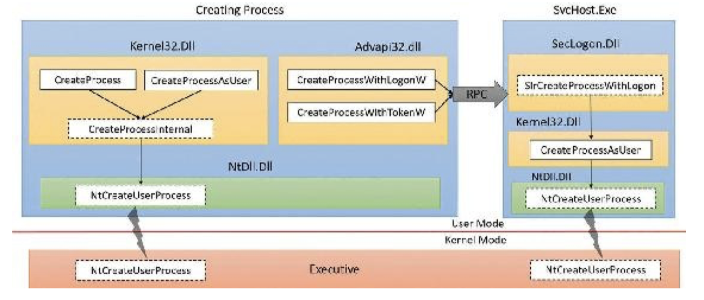
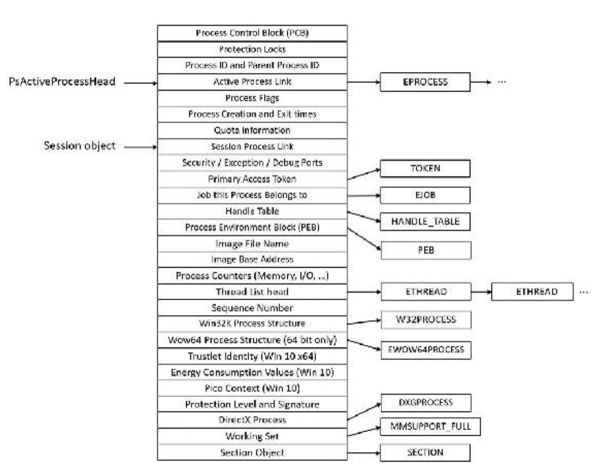
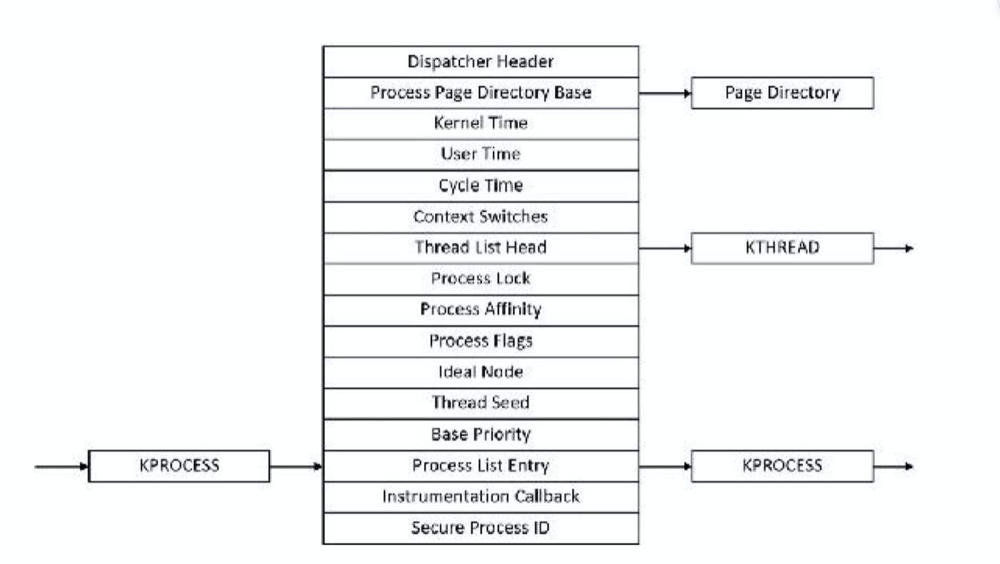
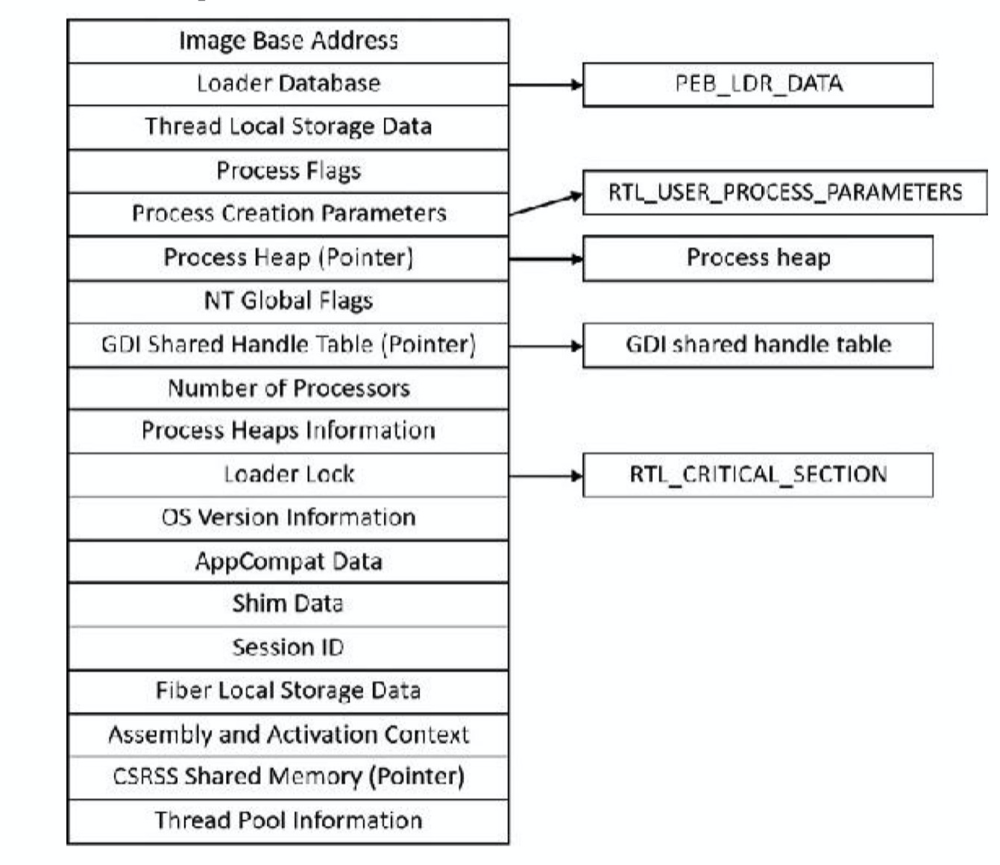
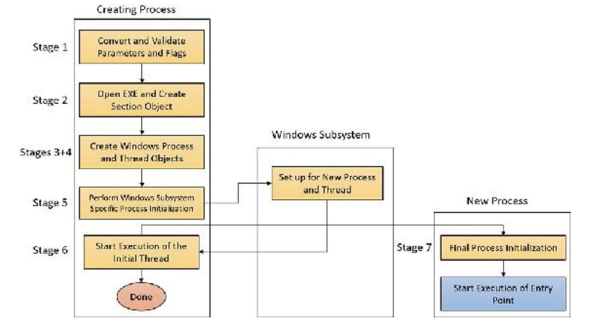
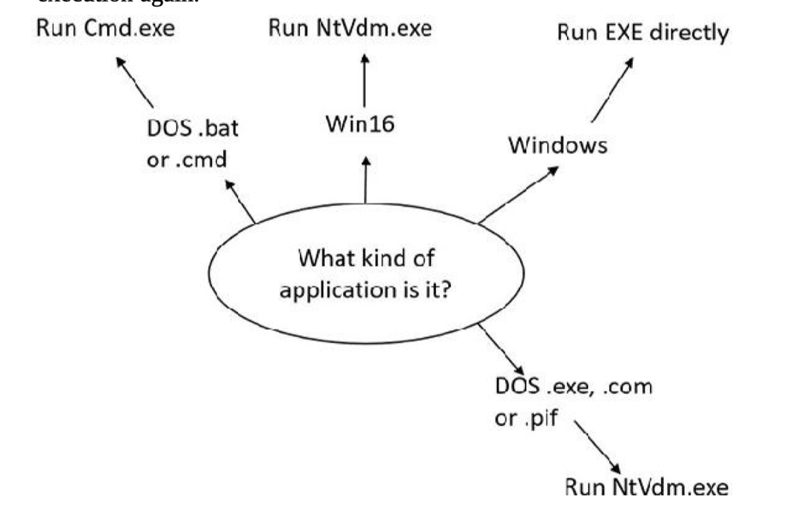
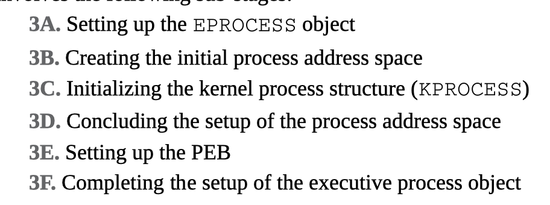

smss：session manager

**Chapter 2 System architecture**

# 系统架构

**Chapter 3 Processes and jobs**

# 进程和工作

前置：熟悉进程和线程，Windows虚拟内存，Windows用户模式和内核模式

**创建进程：**

CreateProcess：创建和当前进程具有相同token的子进程

CreateProcessAsUser：可指定不同的token

ShellExcute、ShellExecuteEx会尝试根据给出的路径和参数启动程序。

最后，所有启动进程的API的底层由CreateProcessInternal（内部函数）实现，最终CreateProcessInternal会调用ntdll里面的NtCreateUserProcess，转换到内核模式，内核中函数名称也是NtCreateUserProcess。

**Creating modern process：**ActivateApplication()：启动store app

**Process Internals：**

进程代表：EPROCESS结构体，因为进程会包括很多线程，那么EPROCESS自然也会存ETHREAD的指针。

EPROCESS等大部分结构体都在内核空间，但PEB存在于用户空间。

Csrss（子系统进程）另外保存了一个叫CSR_PROCESS的结构体，win23k.sys保存了W32PROCESS。

PsSetCreateProcessNofityRoutine可以监视进程的启动/结束，优先于进程（应该是回调函数）

Pcb，类型为KPORCESS的结构体，可以理解为抽象出来，减少耦合度的作用。

Peb存在于用户态，image loader，heap manager需要读取peb的信息进行装载。如果都用系统调用读取只能内核获取的eprocess、kprocess的话，开销会很大。

CSR_PROCESS和W32PROCESS道理差不多，不用过多介绍。

**受保护的进程：**

**CreateProcess流程：**

Stage1：

​	映像之前，CreateProcessInternalW会进行如下操作：

	1. 确定priority class，该值只影响进程内线程的优先级，并不直接影响进程。
 	2. 若不指出priority class，默认是Normal。新进程不会有高于Real-time的优先级。
 	3. 如果creation flags指出进程将被调试，Kernel32会调用DbgUniConnectToDbg初始化一个连接ntdll中的native调试代码，并从当前线程TEB获取debug object的句柄。
 	4. 如果creation flags指出，kernel32设置默认的hard error mode
 	5. 转换用户指定的attribute
 	6. 转换进程的security attributes和提供给API的初始化线程
 	7. check创建的进程是否为modern
 	8. 如果为modern进行一系列操作
 	9. 如果指定debug flag，则Debugger值将被标记为跳过。否则一个debugger将不会创建debuggee进程（否则陷入循环，无限尝试创建debugger进程）
 	10. 处理STATRTUPINFO中关于图形显示的信息
 	11. 应用程序和命令行参数被传递到CreateProcessInternalW分析。(c:\temp\a.exe->\device\harddiskvolume1\temp\a.exe)
 	12. 其他信息将被集成到RTL_USER_PROCESS_PARAMETERS结构体中。

当上述操作结束之后，CreateProcessInternalW初始化调用NtCreateUserProcess尝试创建进程。

Stage2：

​	打开将被执行的映像，此时创建中的线程已经切换到内核模式，继续完成NtCreateUserProcess的系统调用。

1. 再次检查参数，防止被内核级恶意攻击
2. 
3. 如果进程申请protected，需要检查他的签名
4. 若为modern process，需要检查许可等。
5. 若进程为trustlet，section object需要被创建一个特殊的flag，以便secure kernel使用。
6. 如果可执行文件为Windows exe，API尝试打开文件并创建object，此时object并未映射到内存（当然打开的有可能是POSIX或者dll，有可能失败）
7. 当API找到合适的可执行映象，会在注册表中查询他是否有子项。（没懂，打个tag，P203）
8. CreateProcessInternalW会检查要执行文件的格式，比如说要运行的是.bat文件，那么启动的进程就是cmd.exe，如果是exe则检查他的位数、是否可兼容运行等。如果一个支持运行的进程还没被创建，映像就会切到Ntvdm.exe，CreateProcessInternalW再次回到步骤1。

Stage3：创建WIndows可执行的进程结构体。在目前的阶段，NtCreateUserProcess已经打开了一个有效的Windows可执行文件，然后在这个新进程的地址空间已经创建了一个sction object。下一步，他将会通过调用PspAllocateProcess创建一个Windows可执行进程object。

Stage3A：创建EPROCESS object

**Chapter 5 Memory management**

# 内存管理介绍

内存管理的任务：

- 翻译、映射地址（Virtual Address <-> Physical Address）
- 将内存上的内容分页到磁盘上
- 其他服务：内存映射文件（section objects），写时复制，支持应用程序使用更大的空闲空间

内存管理组件：

- main：`Ntoskrnl.exe`
  - 分配、取消分配、管理虚拟内存
  - 解决硬件异常
  - 六个关键的例程，每个例程运行在系统进程中的六个不同内核模式线程之一：
    - **The balance set manager**
    - **The process/stack swapper**：实现进程/内核线程的换入换出
    - **The modified page writer** 
    - **The mapped page writer**
    - **The segment dereference thread**
    - **The zero page thread**

大页和小页：

- 页是保护模式下的最小单元，大小为4K字节，请求的大小若大于2K则会在页开始分配，否则是从页面后部开始分配
- 大页是不可换页的，大页的大小可以达到GB级别。分配的时候并不是以1GB取整，例如有1040MB的分配请求，最终会拿到1个1024MB的大页和2个8MB的普通页。
- 每个页都需要映射一个保护措施

内部同步：

- 自旋锁等

内存管理提供的服务：

- 允许父进程读写子进程的内存（调试器原理）
- API：
  - Virtual API：最底层的内存分配API，例如：VirtualAlloc、VirtualFree、VIrtualProtect、VIrtualLock
  - Heap API：内部实现是Virtual API，例如：HeapAlloc、HeapFree、HeapCreate、HeapReAlloc
  - Memory-mapped files：允许将磁盘上的文件映射到内存里、共享内存等。例如：CreateFileMapping、OpenFileMapping、MapViewOfFile

下图是用户模式的内存API：

虚线框：取决于C/C++运行时内存管理库，例如C：malloc、free、realloc；C++：new、delete。