# 保护模式

~~这部分第一次接触感觉有些杂乱，根据Thunder J的blog进行的学习以及总结，添加了自己的一些想法，等以后学得熟悉了再回来进一步修改~~

待整理：

Linux四级页表及其原理：https://www.jianshu.com/p/242ba363e4ed

中断原理：https://zhuanlan.zhihu.com/p/80903637

Linux内存管理之分页机制：https://cloud.tencent.com/developer/article/1374439 、 https://www.cnblogs.com/vamei/p/9329278.html

## 保护模式初探

32位CPU在16位模式下运行的状态为实模式，当CPU发展到32位的时候出现保护模式，保护模式下CPU变成了32根地址总线，32根地址总线足够访问4GB的空间，为了满足4GB空间寻址，寄存器宽度也增加了一倍，从原来的2字节变为4字节32位。除了段寄存器仍然使用16位，其余通用寄存器都提升到32位。
寄存器要保持向下兼容，不会重新构造原来的基础设备而是在原有的寄存器基础上进行了拓展。经过拓展后的寄存器在原有名字上加了个e，如图所示


### 段描述符

保护模式中的段基址不再是像实模式那样直接存放物理地址，段寄存器中要记录32位地址的数据段基址，16位肯定是装不下的，所以段基址都存储在一个数据结构中——全局描述符表。其中每个表项称为段描述符，其大小为64字节，用来描述各个内存段的起始地址、大小、权限等信息。而这里段寄存器中存放的是段选择子 selector 。如果把全局描述符表当作数组来看的话，段选择子就是数组的下标，用来索引段描述符。该全局描述符表很大，所以放在内存中，由GDTR寄存器指向它。

Tip：因为段描述符是在内存中，CPU访问较慢，效率不高，故在80286的保护模式中增加了一个段描述符缓冲寄存器用来提高效率。CPU每次将获取到的内存信息整理之后存入此寄存器，之后每次访问相同的段时，直接读取对应的段描述符缓冲寄存器即可。

实模式 VS 保护模式寻址模式


32位CPU既支持实模式有支持保护模式，为了区分当前指令到底是哪个模式下运行的，编译器提供了伪指令`bits`

> 指令格式：[bits 16]或[bits 32]，分别对应16位和32位
> [bits 16］是告诉编译器，下面的代码帮我编译成16 位的机器码。
> [bits 32］是告诉编译器，下面的代码帮我编译成32 位的机器码。

举一个例子：

操作数通过反转前缀0x66实现模式转换


同样寻址通过反转前缀0x67实现模式转换


总结一下，保护模式首先是必须向前兼容的，故其访问内存依然是`段基址:段内偏移`的方式，结合前面总结过实模式的一些安全问题，想要解决这些问题就得既保证向前兼容，又保证安全性。CPU工程师想到的方法就是增加更多的安全属性位，下图即是段描述符格式：

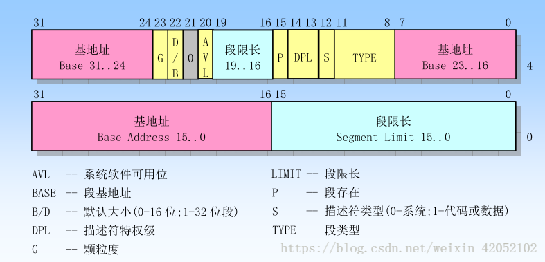

访问内存的形式如下图所示


### 全局描述符

全局描述符表GDT相当于是一个描述符的数组，数组每一个元素都是8个字节的描述符，而选择子则是提供下标在GDT中索引描述符。假设 A[10] 数组即为GDT表，则

- GDT表相当于数组A
- 数组中每个数据A[0]~A[10]相当于描述符
- A[0]~A[10]中的0~10索引下标则是选择子

全局描述符表是公用的，GDTR这个专门的寄存器则存放GDT表的内存地址和大小，是一个48位的寄存器，对这个寄存器操作无法用mov等指令，这里用的是`lgdt`指令初始化，指令格式是：`lgdt 48位内存数据`


举个访问内存的例子，例如选择子是 0x8，将其加载到 ds 寄存器后，访问 ds: 0x9 这样的内存，其过程是首先拆分 0x8 为二进制 `0000 0000 0000 1000` 然后得到 0x8 的低 2 位是RPL，其值为 00。第 2 是 TI ，其值 0，表示是在 GOT 中索引段描述符。用 0x8 的高 13 位 0x1 在 GOT 中索引，也就是 GOT 中的第 1 个段描述符(GDT 中第 0 个段描述符不可用)。假设第 1 个段描述符中的 3个段基址部分，其值为 0x1234 。CPU 将 0xl234 作为段基址，与段内偏移地址 0x9 相加， `0x1234 + 0x9 = 0x123d`。用所得的和 0x123d 作为访存地址。

Tip：GDT中第0个段描述符不可用是为了防止未初始化段选择子，如果未初始化段选择子就会访问到第0个段描述符从而抛出异常。

为了让`段基址:段内偏移`策略继续可用，CPU采取的做法是将超过1MB的部分自动绕回到0地址，继续从0地址开始映射。相当于把地址对1MB求模。超过1MB多余出来的内存被称为高端内存区HMA。

这种地址绕回的做法需要通过两种情况分别讨论：

- 对于只有20位地址线的CPU，不需要任何操作便能自动实现地址绕回
- 当其他有更多地址总线的时候，因为CPU可以访问更多的内存，所以不会产生地址回滚。这种情况下的解决方案就是对第21根地址线进行操作。开启A20则直接访问物理地址即可，关闭A20则使用回绕方式访问。

打开A20的操作方法有以下三个步骤，主要是将0x92端口第一位置一即可

```asm
in al, 0x92
or al, 0000_0010B
out 0x92, al
```

### CR0寄存器

CRx系列寄存器属于控制寄存器一类，这里主要介绍CR0寄存器，这个寄存器如下图所示，其中第0位PE位表示是否开启保护模式。


对CR0的PE位操作如下所示

```asm
mov eax,cr0
or eax,0x00000001
mov cr0,eax
```

现在基础知识总结的差不多了，进入下一个实验阶段，更新我们的mbr和loader，因为我们的loader.bin会超过512字节，所以要把mbr.S中加载loader.bin的读入扇区数增大，目前是1扇区，这里直接改为4扇区

```asm
...
52 mov cx, 4         ; 带读入的扇区数
53 call rd_disk_m_16 ; 以下读取程序的起始部分(一个扇区)
...
```

### 进入保护模式

现在基础知识总结的差不多了，进入下一个实验阶段，更新我们的mbr和loader，因为我们的loader.bin会超过512字节，所以要把mbr.S中加载loader.bin的读入扇区数增大，目前是1扇区，这里直接改为4扇区

```asm
...
52 mov cx, 4         ; 带读入的扇区数
53 call rd_disk_m_16 ; 以下读取程序的起始部分(一个扇区)
...
```

如下图所示，cx 寄存器中存放的这个参数非常重要，代表读入扇区数，如果`loader.bin`的大小超过mbr读入的扇区数，就需要对这个参数进行修改


接下来就是更新`boot.inc`，里面存放的是`loader.S`的一些符号信息，相当于头文件，比之前主要多定义了GDT描述符的属性和选择子的属性。Linux使用的是平坦模型，整个内存都在一个段里，这里平坦模型在我们定义的描述符中，段基址是0，`段界限 * 粒度 = 4G` 粒度选的是4k，故段界限是 0xFFFFF

```asm
;boot.inc
;--------------------- loader 和 kernel---------------------

LOADER_BASE_ADDR equ 0x900
LOADER_START_SECTOR equ 0x2

;--------------------  gdt 描述符属性  ----------------------
DESC_G_4K         equ 1_00000000000000000000000b        ;描述符的G位为4k粒度，以二进制表示，下划线可去掉
DESC_D_32         equ  1_0000000000000000000000b
DESC_L            equ   0_000000000000000000000b        ;64位代码标记，此处标记为0便可
DESC_AVL          equ    0_00000000000000000000b        ;CPU不用此位，暂置为0
DESC_LIMIT_CODE2  equ     1111_0000000000000000b        ;段界限，需要设置为0xFFFFF
DESC_LIMIT_DATA2  equ     DESC_LIMIT_CODE2
DESC_LIMIT_VIDEO2 equ      0000_000000000000000b
DESC_P			  equ         1_000000000000000b
DESC_DPL_0        equ          00_0000000000000b
DESC_DPL_1		  equ          01_0000000000000b
DESC_DPL_2        equ		   10_0000000000000b
DESC_DPL_3        equ          11_0000000000000b
DESC_S_CODE		  equ            1_000000000000b
DESC_S_DATA       equ            DESC_S_CODE
DESC_S_sys        equ            0_000000000000b
DESC_TYPE_CODE    equ             1000_00000000b		;x=1,c=0,r=0,a=0 代码段是可执行的,非一致性,不可读,已访问位a清0.  
DESC_TYPE_DATA    equ             0010_00000000b		;x=0,e=0,w=1,a=0 数据段是不可执行的,向上扩展的,可写,已访问位a清0.

DESC_CODE_HIGH4 equ (0x00 << 24) + DESC_G_4K + DESC_D_32 + DESC_L + DESC_AVL + DESC_LIMIT_CODE2 + DESC_P + DESC_DPL_0 + DESC_S_CODE + DESC_TYPE_CODE + 0x00 ;定义代码段的高四字节，(0x00 << 24)表示"段基址的24~31"字段，该字段位于段描述符高四字节24~31位，平坦模式段基址为0，所以这里用0填充，最后的0x00也是
DESC_DATA_HIGH4 equ (0x00 << 24) + DESC_G_4K + DESC_D_32 + DESC_L + DESC_AVL + DESC_LIMIT_DATA2 + DESC_P + DESC_DPL_0 + DESC_S_DATA + DESC_TYPE_DATA + 0x00
DESC_VIDEO_HIGH4 equ (0x00 << 24) + DESC_G_4K + DESC_D_32 + DESC_L + DESC_AVL + DESC_LIMIT_VIDEO2 + DESC_P + DESC_DPL_0 + DESC_S_DATA + DESC_TYPE_DATA + 0x0b

;--------------   选择子属性  ---------------
RPL0  equ   00b
RPL1  equ   01b
RPL2  equ   10b
RPL3  equ   11b
TI_GDT	 equ   000b
TI_LDT	 equ   100b
```

下面修改 `loader.S`

```asm
;loader.S
%include "boot.inc"
   section loader vstart=LOADER_BASE_ADDR
   LOADER_STACK_TOP equ LOADER_BASE_ADDR
   jmp loader_start                    ; 此处的物理地址是:

;构建gdt及其内部的描述符
   GDT_BASE:   dd    0x00000000
           dd    0x00000000

   CODE_DESC:  dd    0x0000FFFF
           dd    DESC_CODE_HIGH4

   DATA_STACK_DESC:  dd    0x0000FFFF
             dd    DESC_DATA_HIGH4

   VIDEO_DESC: dd    0x80000007           ;limit=(0xbffff-0xb8000)/4k=0x7
           dd    DESC_VIDEO_HIGH4  ; 此时dpl已改为0

   GDT_SIZE   equ   $ - GDT_BASE
   GDT_LIMIT   equ   GDT_SIZE -    1
   times 60 dq 0                     ; 此处预留60个描述符的slot
   SELECTOR_CODE equ (0x0001<<3) + TI_GDT + RPL0         ; 相当于(CODE_DESC - GDT_BASE)/8 + TI_GDT + RPL0
   SELECTOR_DATA equ (0x0002<<3) + TI_GDT + RPL0     ; 同上
   SELECTOR_VIDEO equ (0x0003<<3) + TI_GDT + RPL0     ; 同上

   ;以下是定义gdt的指针，前2字节是gdt界限，后4字节是gdt起始地址

   gdt_ptr  dw  GDT_LIMIT
        dd  GDT_BASE
   loadermsg db '2 loader in real.'

   loader_start:

;------------------------------------------------------------
;INT 0x10    功能号:0x13    功能描述:打印字符串
;------------------------------------------------------------
;输入:
;AH 子功能号=13H
;BH = 页码
;BL = 属性(若AL=00H或01H)
;CX＝字符串长度
;(DH、DL)＝坐标(行、列)
;ES:BP＝字符串地址
;AL＝显示输出方式
;   0——字符串中只含显示字符，其显示属性在BL中。显示后，光标位置不变
;   1——字符串中只含显示字符，其显示属性在BL中。显示后，光标位置改变
;   2——字符串中含显示字符和显示属性。显示后，光标位置不变
;   3——字符串中含显示字符和显示属性。显示后，光标位置改变
;无返回值
   mov     sp, LOADER_BASE_ADDR
   mov     bp, loadermsg           ; ES:BP = 字符串地址
   mov     cx, 17             ; CX = 字符串长度
   mov     ax, 0x1301         ; AH = 13,  AL = 01h
   mov     bx, 0x001f         ; 页号为0(BH = 0) 蓝底粉红字(BL = 1fh)
   mov     dx, 0x1800         ;
   int     0x10                    ; 10h 号中断

;----------------------------------------   准备进入保护模式   ------------------------------------------
                                    ;1 打开A20
                                    ;2 加载gdt
                                    ;3 将cr0的pe位置1


   ;-----------------  打开A20  ----------------
   in al,0x92
   or al,0000_0010B
   out 0x92,al

   ;-----------------  加载GDT  ----------------
   lgdt [gdt_ptr]


   ;-----------------  cr0第0位置1  ----------------
   mov eax, cr0
   or eax, 0x00000001
   mov cr0, eax

   ;jmp dword SELECTOR_CODE:p_mode_start         ; 刷新流水线，避免分支预测的影响,这种cpu优化策略，最怕jmp跳转，
   jmp  SELECTOR_CODE:p_mode_start         ; 刷新流水线，避免分支预测的影响,这种cpu优化策略，最怕jmp跳转，
                         ; 这将导致之前做的预测失效，从而起到了刷新的作用。

[bits 32]
p_mode_start:
   mov ax, SELECTOR_DATA
   mov ds, ax
   mov es, ax
   mov ss, ax
   mov esp,LOADER_STACK_TOP
   mov ax, SELECTOR_VIDEO
   mov gs, ax

   mov byte [gs:160], 'P'

   jmp $
```

同之前的方法编译，注意这里loader.bin编译后为615个字节，需要2个扇区大小，写入磁盘时要给count赋值为2


> MBR :		sudo dd if=mbr.bin of=./hd60M.img bs=512 count=1 conv=notrunc
>
> Loader :	sudo dd if=loader.bin of=./hd60M.img bs=512 count=2 seek=2 conv=notrunc

运行结果如下，其中`1 MBR`来自实模式下的mbr.S，`2 loader in real`来自实模式下用BIOS中断0x10实现的，左上角第二行的`P`是在保护模式下输出的。


查看GDT表中的内容和我们设置的相符，其中第0个不可用。查看寄存器信息PE位设置为1表示已经进入保护模式。


保护模式对内存的保护体现在如下几个方面：

1. **向段寄存器加载段选择子时的保护**

   当引用一个内存段时，实际上就是往段寄存器中加载个段选择子，为了避免非法引用内存段的情况，会检查选择子是否合理，判断方法就是通过验证索引值是否出现越界，越界则抛出异常。有如下表达式

   > 描述符表基地址+选择子中的索引值*8+7<=描述符表基地址+描述符表界限值

   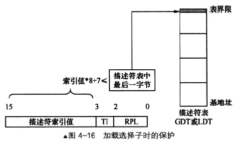

   检查完选择子就该检查段描述符中 type 字段，也就是段的类型，如下图所示

   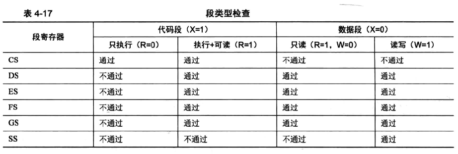

   检查完类型后检查P位，P位表示该段是否存在，1表示存在，0表示不存在。

2. **代码段和数据段的保护**

   代码段和数据段主要保护措施是当CPU访问一个地址的时候，判断该地址不能超过所在内存段的范围。简单总结如下图所示，出现这种跨段操作就会出现异常。

   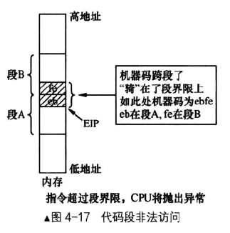

3. **栈段的保护**

   段描述符type中的e位表示扩展方向，栈可以向上扩展和向下扩展，下面就是检查方式

   - 对于向上拓展的段，实际段界限是段内可以访问的最后一个字节

   - 对于向下拓展的段，实际段界限是段内不可以访问的第一个字节

   等价于如下表达式

   ```
   实际段界限+1<=esp-操作数大小<=0xFFFFFFFF
   ```

   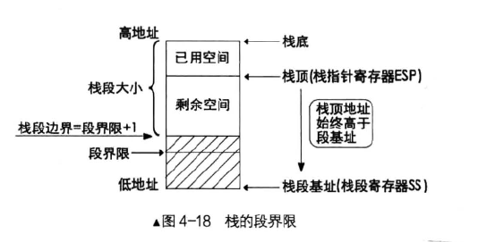

## 保护模式进阶

### 获取物理内存容量

　　Linux获取内存容量方法有三种，本质上分别是BIOS中断0x15的3个子功能，BIOS是实模式下的方法，只能在保护模式之前调用。总结如下

**利用BIOS中断0x15子功能0xe820获取内存**

此方法最灵活，返回的内容也最丰富，内存信息的内容是地址范围描述符来描述的(ARDS)，每个字段4字节，一共20字节，调用0x15返回的也就是这个结构。其中Type字段表示内存类型，1表示这段内存可以使用；2表示不可用使用此内存；其它表示未定义，将来会用到


用0x15子功能0xe820调用说明和调用步骤如下

1. 填写好”调用前输入”中列出的寄存器
2. 执行中断调用 int 0x15
3. 在CF位为0的情况下，”返回后输出”中对应的寄存器中就有结果


**利用BIOS中断0x15子功能0xe801获取内存**

此方法最多识别4G的内存，结果存放在两组寄存器中，操作起来要简便一些，调用说明和调用步骤如下

1. AX寄存器写入0xE801
2. 执行中断调用 int 0x15
3. 在CF位为0的情况下，”返回后输出”中对应的寄存器中就有结果


实例：


**利用BIOS中断0x15子功能0x88获取内存**

此方法最多识别64MB内存，操作起来最简单，调用说明和调用步骤如下

1. AX寄存器写入0x88
2. 执行中断调用 int 0x15
3. 在CF位为0的情况下，”返回后输出”中对应的寄存器中就有结果


下面结合这三种方式改进我们的实验代码，下面是`loader`，我们将结果保存在了`total_mem_bytes`中，重要的一些地方都有注释，更详细的内容建议参考书中P183

```asm
;loader-plus.S
%include "boot.inc"
   section loader vstart=LOADER_BASE_ADDR
   LOADER_STACK_TOP equ LOADER_BASE_ADDR
   
;构建gdt及其内部的描述符
   GDT_BASE:   dd    0x00000000 
	       dd    0x00000000

   CODE_DESC:  dd    0x0000FFFF 
	       dd    DESC_CODE_HIGH4

   DATA_STACK_DESC:  dd    0x0000FFFF
		     dd    DESC_DATA_HIGH4

   VIDEO_DESC: dd    0x80000007	   ; limit=(0xbffff-0xb8000)/4k=0x7
	       dd    DESC_VIDEO_HIGH4  ; 此时dpl为0

   GDT_SIZE   equ   $ - GDT_BASE
   GDT_LIMIT   equ   GDT_SIZE -	1 
   times 60 dq 0					 ; 此处预留60个描述符的空位(slot)
   SELECTOR_CODE equ (0x0001<<3) + TI_GDT + RPL0     ; 相当于(CODE_DESC - GDT_BASE)/8 + TI_GDT + RPL0
   SELECTOR_DATA equ (0x0002<<3) + TI_GDT + RPL0	 ; 同上
   SELECTOR_VIDEO equ (0x0003<<3) + TI_GDT + RPL0	 ; 同上 

   ; total_mem_bytes用于保存内存容量,以字节为单位,此位置比较好记。
   ; 当前偏移loader.bin文件头0x200字节,loader.bin的加载地址是0x900,
   ; 故total_mem_bytes内存中的地址是0xb00.将来在内核中咱们会引用此地址
   total_mem_bytes dd 0					 
   ;;;;;;;;;;;;;;;;;;;;;;;;;;;;;;;;;;;;;;;;;;;;;;;;;;;;

   ;以下是定义gdt的指针，前2字节是gdt界限，后4字节是gdt起始地址
   gdt_ptr  dw  GDT_LIMIT 
	    dd  GDT_BASE

   ;人工对齐:total_mem_bytes4字节+gdt_ptr6字节+ards_buf244字节+ards_nr2,共256字节
   ards_buf times 244 db 0
   ards_nr dw 0		      ;用于记录ards结构体数量

   loader_start:
   
;-------  int 15h eax = 0000E820h ,edx = 534D4150h ('SMAP') 获取内存布局  -------

   xor ebx, ebx		      ;第一次调用时，ebx值要为0
   mov edx, 0x534d4150	  ;edx只赋值一次，循环体中不会改变
   mov di, ards_buf	      ;ards结构缓冲区
.e820_mem_get_loop:	      ;循环获取每个ARDS内存范围描述结构
   mov eax, 0x0000e820	  ;执行int 0x15后,eax值变为0x534d4150,所以每次执行int前都要更新为子功能号。
   mov ecx, 20		      ;ARDS地址范围描述符结构大小是20字节
   int 0x15
   jc .e820_failed_so_try_e801   ;若cf位为1则有错误发生，尝试0xe801子功能
   add di, cx		      ;使di增加20字节指向缓冲区中新的ARDS结构位置
   inc word [ards_nr]	  ;记录ARDS数量
   cmp ebx, 0		      ;若ebx为0且cf不为1,这说明ards全部返回，当前已是最后一个
   jnz .e820_mem_get_loop

;在所有ards结构中，找出(base_add_low + length_low)的最大值，即内存的容量。
   mov cx, [ards_nr]	  ;遍历每一个ARDS结构体,循环次数是ARDS的数量
   mov ebx, ards_buf 
   xor edx, edx		      ;edx为最大的内存容量,在此先清0
.find_max_mem_area:	      ;无须判断type是否为1,最大的内存块一定是可被使用
   mov eax, [ebx]	      ;base_add_low
   add eax, [ebx+8]	      ;length_low
   add ebx, 20		      ;指向缓冲区中下一个ARDS结构
   cmp edx, eax		      ;冒泡排序，找出最大,edx寄存器始终是最大的内存容量
   jge .next_ards
   mov edx, eax		      ;edx为总内存大小
.next_ards:
   loop .find_max_mem_area
   jmp .mem_get_ok

;------  int 15h ax = E801h 获取内存大小,最大支持4G  ------
; 返回后, ax cx 值一样,以KB为单位,bx dx值一样,以64KB为单位
; 在ax和cx寄存器中为低16M,在bx和dx寄存器中为16MB到4G。
.e820_failed_so_try_e801:
   mov ax,0xe801
   int 0x15
   jc .e801_failed_so_try88   ;若当前e801方法失败,就尝试0x88方法

;1 先算出低15M的内存,ax和cx中是以KB为单位的内存数量,将其转换为以byte为单位
   mov cx,0x400	     ;cx和ax值一样,cx用做乘数
   mul cx 
   shl edx,16
   and eax,0x0000FFFF
   or edx,eax
   add edx, 0x100000 ;ax只是15MB,故要加1MB
   mov esi,edx	     ;先把低15MB的内存容量存入esi寄存器备份

;2 再将16MB以上的内存转换为byte为单位,寄存器bx和dx中是以64KB为单位的内存数量
   xor eax,eax
   mov ax,bx		
   mov ecx, 0x10000	;0x10000十进制为64KB
   mul ecx		    ;32位乘法,默认的被乘数是eax,积为64位,高32位存入edx,低32位存入eax.
   add esi,eax		;由于此方法只能测出4G以内的内存,故32位eax足够了,edx肯定为0,只加eax便可
   mov edx,esi		;edx为总内存大小
   jmp .mem_get_ok

;-----------------  int 15h ah = 0x88 获取内存大小,只能获取64M之内  ----------
.e801_failed_so_try88: 
   ;int 15后，ax存入的是以kb为单位的内存容量
   mov  ah, 0x88
   int  0x15
   jc .error_hlt
   and eax,0x0000FFFF
      
   ;16位乘法，被乘数是ax,积为32位.积的高16位在dx中，积的低16位在ax中
   mov cx, 0x400     ;0x400等于1024,将ax中的内存容量换为以byte为单位
   mul cx
   shl edx, 16	     ;把dx移到高16位
   or edx, eax	     ;把积的低16位组合到edx,为32位的积
   add edx,0x100000  ;0x88子功能只会返回1MB以上的内存,故实际内存大小要加上1MB

.mem_get_ok:
   mov [total_mem_bytes], edx	 ;将内存换为byte单位后存入total_mem_bytes处。


;-----------------   准备进入保护模式   -------------------
;1 打开A20
;2 加载gdt
;3 将cr0的pe位置1

   ;-----------------  打开A20  ----------------
   in al,0x92
   or al,0000_0010B
   out 0x92,al

   ;-----------------  加载GDT  ----------------
   lgdt [gdt_ptr]

   ;-----------------  cr0第0位置1  ----------------
   mov eax, cr0
   or eax, 0x00000001
   mov cr0, eax

   jmp dword SELECTOR_CODE:p_mode_start	   ; 刷新流水线，避免分支预测的影响,这种cpu优化策略，最怕jmp跳转，
					                     ; 这将导致之前做的预测失效，从而起到了刷新的作用。
.error_hlt:		      ;出错则挂起
   hlt

[bits 32]
p_mode_start:
   mov ax, SELECTOR_DATA
   mov ds, ax
   mov es, ax
   mov ss, ax
   mov esp,LOADER_STACK_TOP
   mov ax, SELECTOR_VIDEO
   mov gs, ax

   mov byte [gs:160], 'P'

   jmp $
```

在`mbr.S`中也需要修改一处内容，我们跳转的内容要加上0x300，原因是在 loader.S 中`loader_start`计算如下

> (4个段描述符 + 60个段描述符槽位) * 8字节 = total_mem_bytes_offset
>
> (4 + 60) * 8 = 512 = 0x200
>
> total_mem_bytes + gdt_ptr + ards_buf + adrs_nr + total_mem_bytes_offset = loader_start
>
> 4 + 6 + 244 + 2 + 0x200 = 0x300

修改片断如下:

```asm
;mbr-plus.S
[...] 
   mov eax,LOADER_START_SECTOR
   mov bx,LOADER_BASE_ADDR
   mov cx,4
   call rd_disk_m_16
  
   jmp LOADER_BASE_ADDR+0x300 ; 这里

rd_disk_m_16:	   
[...]
```

运行结果如下，这里我们用`xp 0xb00`查看我们的结果，`0x02000000`换算过来刚好是我们`bochsrc.disk`中 megs 设置的32MB大小

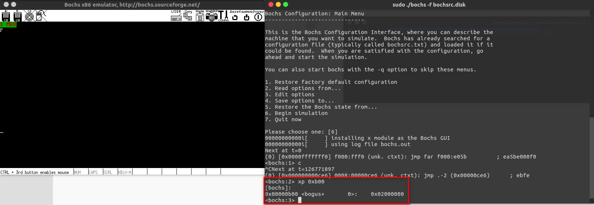

### 启动分页机制

　　分页机制是当物理内存不足时，或者内存碎片过多无法容纳新进程等情况的一种应对措施。假如说此时未开启分页功能，而物理内存空间又不足，如下图所示，此时线性地址和物理地址一一对应，没有满足进程C的内存大小，可以选择等待进程B或者A执行完获得连续的内存空间，也可以将A3或者B1段换到硬盘上，腾出一部分空间，然而这些IO操作过多会使机器响应速度很慢，用户体验很差。


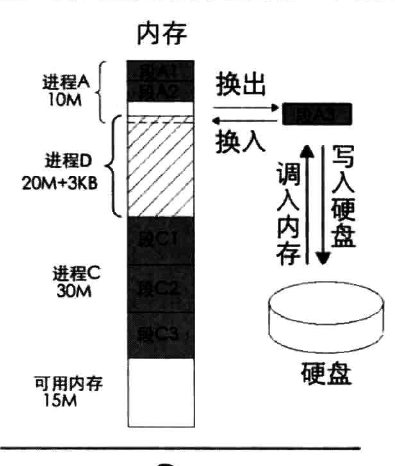

出现这种情况的本质其实是在分段机制下，线性地址等价于物理地址。那么即使在进程B的下面还有10M的可用空间，但因为两块可用空间并不连续，所以进程C无法使用进程B下面的10M可用空间。

为了解决以上问题，可以提供线性地址连续，物理地址不连续的方案，再用某种映射关系将两个地址联系起来，那么分页机制就诞生了。

### 一级页表

　　在保护模式下寻址依旧是通过`段基址:段内偏移`组成的线性地址，计算出线性地址后再通过判断分页位是否打开，若打开则开启分页机制进行检索，如下图所示


分页机制的作用有

- 将线性地址转换成物理地址
- 用大小相等的页代替大小不等的段

分页机制的作用如下图所示，分页机制来映射的线性地址便是我们经常说的虚拟地址

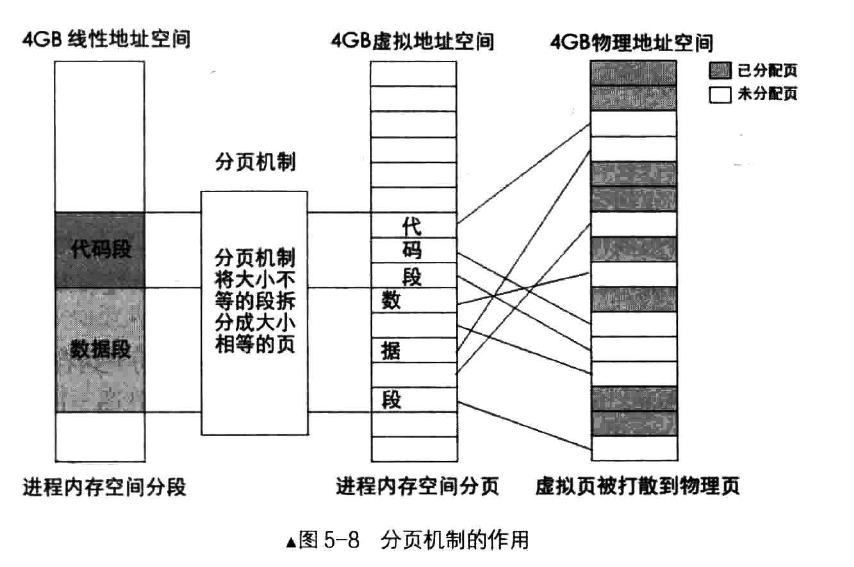

因为`页大小 * 页数量 = 4GB`，想要减少页表的大小，只能增加一页的大小。最终通过数学求极限，定下4KB为最佳页大小。页表将线性地址转换成物理地址的过程总结如下图，首先通过计算线性地址高20位索引出页表中的基址，然后加上低12位计算出最终的物理地址，下图中0x9234即是最终的物理地址

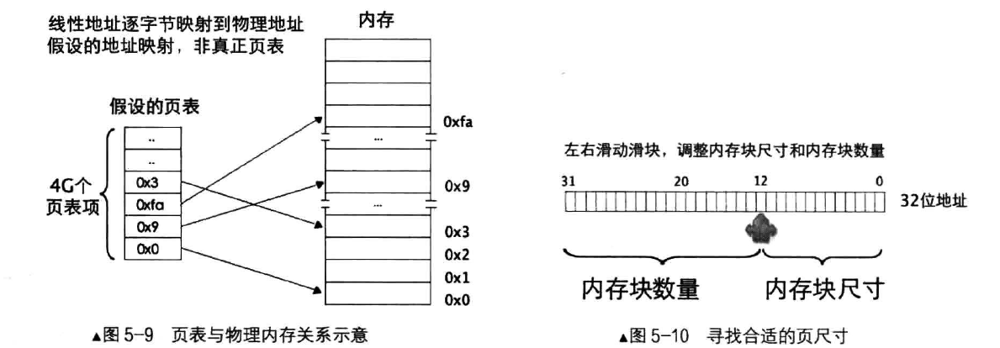

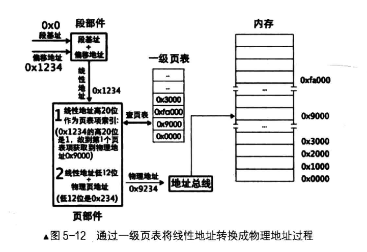

### 二级页表

无论是几级页表，标准页的尺寸都是4KB。所以4GB的线性地址空间最多有1M个标准页。一级页表是将这1M个标准页放置到一张页表中，二级页表是将这1M个标准页平均放置1K个页表中，每个页表包含有1K个页表项。页表项是4字节大小，页表包含1K个页表项，故页表的大小同样为4KB，刚好为一页。

为了管理页表的物理地址，专门有一个页目录表来存放这些页表。页目录表中存储的页表称为页目录项(PDE)，页目录项同样为4KB，且最多有1K个页目录项，所以页目录表也是4KB，如下图所示


二级页表中虚拟地址到物理地址的转换也有很大的变化，具体步骤如下

- 用虚拟地址的高 10 位乘以 4，作为页目录表内的偏移地址，加上页目录表的物理地址，所得的和，便是页目录项的物理地址。读取该页目录项，从中获取到页表的物理地址。
- 用虚拟地址的中间 10 位乘以 4，作为页表内的偏移地址，加上在第 1 步中得到的页表物理地址，所得的和，便是页表项的物理地址。读取该页表项，从中获取到分配的物理页地址。
- 虚拟地址的高 10 位和中间 10 位分别是 PDE PIE 的索引值，所以它们需要乘以 4。但低 12 位就不是索引值了，其表示的范围是 0~0xfff，作为页内偏移最合适，所以虚拟地址的低 12 位加上第二步中得到的物理页地址，所得的和便是最终转换的物理地址。

还是用书中的图最直观，下图表示`mov ax, [0x1234567]`的转换过程，可以发现cr3寄存器其实指向的是页目录表基地址

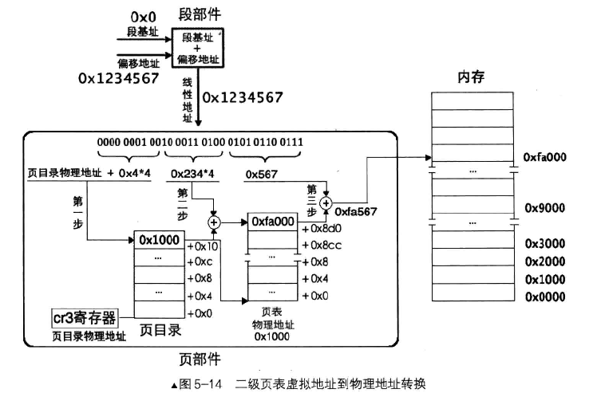

需要注意的是，每个进程后有自己的页表


PDE和PTE的结构如下图所示

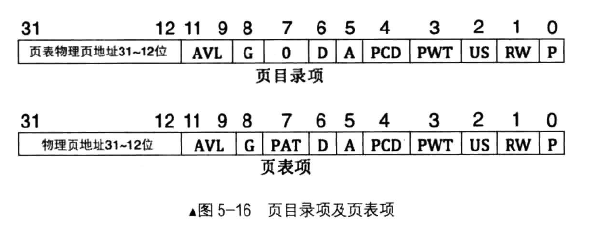

从低到高位进行介绍：


总结这些步骤，我们启用分页机制需要做的事情如下

1. 准备好页目录表及页表
2. 将页表地址写入控制寄存器cr3
3. 寄存器cr0的PG位置1

下面是创建页目录及页表的代码

```asm
; 创建页目录及页表
setup_page:
; 先把页目录占用的空间逐字节清零
	mov ecx, 4096
	mov esi, 0
.clear_page_dir:
	mov byte [PAGE_DIR_TABLE_POS + esi], 0
	inc esi
	loop .clear_page_dir

; 开始创建页目录项(PDE)
.create_pde:        ; 创建PDE
	mov eax, PAGE_DIR_TABLE_POS
	add eax, 0x1000 ; 此时eax为第一个页表的位置及属性
	mov ebx, eax    ; 此处为ebx赋值,是为.create_pte做准备,ebx为基址

; 下面将页目录项0和0xc00都存为第一个页表的地址，每个页表表示4MB内存
; 这样0xc03fffff以下的地址和0x003fffff以下的地址都指向相同的页表
; 这是为将地址映射为内核地址做准备
	or eax, PG_US_U | PG_RW_W | PG_P      ; 页目录项的属性RW和P位为1,US为1,表示用户属性,所有特权级别都可以访问.
	mov [PAGE_DIR_TABLE_POS + 0x0], eax   ; 第1个目录项,在页目录表中的第1个目录项写入第一个页表的位置(0x101000)及属性(7)
	mov [PAGE_DIR_TABLE_POS + 0xc00], eax ; 一个页表项占用四字节
	; 0xc00表示第768个页表占用的目录项,0xc00以上的目录项用于内核空间
	; 也就是页表的0xc0000000~0xffffffff这1G属于内核
	; 0x0~0xbfffffff这3G属于用户进程
	sub eax, 0x1000
	mov [PAGE_DIR_TABLE_POS + 4092], eax  ; 使最后一个目录项指向页目录表自己的地址
	
; 下面创建页表项(PTE)
	mov ecx, 256	; 1M低端内存 / 每页大小 4K = 256
	mov esi, 0
	mov edx, PG_US_U | PG_RW_W | PG_P	; 属性为7
.create_pte:		; 创建PTE
	mov [ebx+esi*4], edx ; 此时的edx为0x101000,也就是第一个页表的地址
	add edx, 4096
	inc esi
	loop .create_pte

; 创建内核其他页表的PDE
	mov eax, PAGE_DIR_TABLE_POS
	add eax, 0x2000						; 此时eax为第二个页表的位置
	or eax, PG_US_U | PG_RW_W | PG_P	; 属性为7
	mov ebx, PAGE_DIR_TABLE_POS
	mov ecx, 254						; 范围为第769~1022的所有目录项数量
	mov esi, 769
.create_kernel_pde:
	mov [ebx+esi*4], eax
    inc esi
    add eax, 0x1000
    loop .create_kernel_pde
    ret
```

在boot.inc中添加如下信息

```asm
; loader 和 kernel
PAGE_DIR_TABLE_POS equ 0x100000
; 页表相关属性
PG_P equ 1b
PG_RW_R equ 00b
PG_RW_W equ 10b
PG_US_S equ 000b
PG_US_U equ 100b
```

进行完第一步的内容，之后的操作相对就简单了，将页表地址写入控制寄存器cr3寄存器和将cr0的PG位置1的操作整合起来的`loader.S`如下所示

```asm
;loader-advanced.S
%include "boot.inc"
section loader vstart=LOADER_BASE_ADDR
LOADER_STACK_TOP equ LOADER_BASE_ADDR

;构建gdt及其内部的描述符
GDT_BASE:   dd    0x00000000 
       dd    0x00000000

CODE_DESC:  dd    0x0000FFFF 
       dd    DESC_CODE_HIGH4

DATA_STACK_DESC:  dd    0x0000FFFF
	     dd    DESC_DATA_HIGH4

VIDEO_DESC: dd    0x80000007	   ; limit=(0xbffff-0xb8000)/4k=0x7
       dd    DESC_VIDEO_HIGH4  ; 此时dpl为0

GDT_SIZE   equ   $ - GDT_BASE
GDT_LIMIT   equ   GDT_SIZE -	1 
times 60 dq 0					 ; 此处预留60个描述符的空位(slot)
SELECTOR_CODE equ (0x0001<<3) + TI_GDT + RPL0     ; 相当于(CODE_DESC - GDT_BASE)/8 + TI_GDT + RPL0
SELECTOR_DATA equ (0x0002<<3) + TI_GDT + RPL0	 ; 同上
SELECTOR_VIDEO equ (0x0003<<3) + TI_GDT + RPL0	 ; 同上 

; total_mem_bytes用于保存内存容量,以字节为单位,此位置比较好记。
; 当前偏移loader.bin文件头0x200字节,loader.bin的加载地址是0x900,
; 故total_mem_bytes内存中的地址是0xb00.将来在内核中咱们会引用此地址
total_mem_bytes dd 0					 
;;;;;;;;;;;;;;;;;;;;;;;;;;;;;;;;;;;;;;;;;;;;;;;;;;;;

;以下是定义gdt的指针，前2字节是gdt界限，后4字节是gdt起始地址
gdt_ptr  dw  GDT_LIMIT 
    dd  GDT_BASE

;人工对齐:total_mem_bytes4字节+gdt_ptr6字节+ards_buf244字节+ards_nr2,共256字节
ards_buf times 244 db 0
ards_nr dw 0		      ;用于记录ards结构体数量

loader_start:

;-------  int 15h eax = 0000E820h ,edx = 534D4150h ('SMAP') 获取内存布局  -------

   xor ebx, ebx		      ;第一次调用时，ebx值要为0
   mov edx, 0x534d4150	  ;edx只赋值一次，循环体中不会改变
   mov di, ards_buf	      ;ards结构缓冲区
.e820_mem_get_loop:	      ;循环获取每个ARDS内存范围描述结构
   mov eax, 0x0000e820	  ;执行int 0x15后,eax值变为0x534d4150,所以每次执行int前都要更新为子功能号。
   mov ecx, 20		      ;ARDS地址范围描述符结构大小是20字节
   int 0x15
   jc .e820_failed_so_try_e801   ;若cf位为1则有错误发生，尝试0xe801子功能
   add di, cx		      ;使di增加20字节指向缓冲区中新的ARDS结构位置
   inc word [ards_nr]	  ;记录ARDS数量
   cmp ebx, 0		      ;若ebx为0且cf不为1,这说明ards全部返回，当前已是最后一个
   jnz .e820_mem_get_loop

;在所有ards结构中，找出(base_add_low + length_low)的最大值，即内存的容量。
   mov cx, [ards_nr]	  ;遍历每一个ARDS结构体,循环次数是ARDS的数量
   mov ebx, ards_buf 
   xor edx, edx		      ;edx为最大的内存容量,在此先清0
.find_max_mem_area:	      ;无须判断type是否为1,最大的内存块一定是可被使用
   mov eax, [ebx]	      ;base_add_low
   add eax, [ebx+8]	      ;length_low
   add ebx, 20		      ;指向缓冲区中下一个ARDS结构
   cmp edx, eax		      ;冒泡排序，找出最大,edx寄存器始终是最大的内存容量
   jge .next_ards
   mov edx, eax		      ;edx为总内存大小
.next_ards:
   loop .find_max_mem_area
   jmp .mem_get_ok

;------  int 15h ax = E801h 获取内存大小,最大支持4G  ------
; 返回后, ax cx 值一样,以KB为单位,bx dx值一样,以64KB为单位
; 在ax和cx寄存器中为低16M,在bx和dx寄存器中为16MB到4G。
.e820_failed_so_try_e801:
   mov ax,0xe801
   int 0x15
   jc .e801_failed_so_try88   ;若当前e801方法失败,就尝试0x88方法

;1 先算出低15M的内存,ax和cx中是以KB为单位的内存数量,将其转换为以byte为单位
   mov cx,0x400	     ;cx和ax值一样,cx用做乘数
   mul cx 
   shl edx,16
   and eax,0x0000FFFF
   or edx,eax
   add edx, 0x100000 ;ax只是15MB,故要加1MB
   mov esi,edx	     ;先把低15MB的内存容量存入esi寄存器备份

;2 再将16MB以上的内存转换为byte为单位,寄存器bx和dx中是以64KB为单位的内存数量
   xor eax,eax
   mov ax,bx		
   mov ecx, 0x10000	;0x10000十进制为64KB
   mul ecx		    ;32位乘法,默认的被乘数是eax,积为64位,高32位存入edx,低32位存入eax.
   add esi,eax		;由于此方法只能测出4G以内的内存,故32位eax足够了,edx肯定为0,只加eax便可
   mov edx,esi		;edx为总内存大小
   jmp .mem_get_ok

;-----------------  int 15h ah = 0x88 获取内存大小,只能获取64M之内  ----------
.e801_failed_so_try88: 
   ;int 15后，ax存入的是以kb为单位的内存容量
   mov  ah, 0x88
   int  0x15
   jc .error_hlt
   and eax,0x0000FFFF
      
   ;16位乘法，被乘数是ax,积为32位.积的高16位在dx中，积的低16位在ax中
   mov cx, 0x400     ;0x400等于1024,将ax中的内存容量换为以byte为单位
   mul cx
   shl edx, 16	     ;把dx移到高16位
   or edx, eax	     ;把积的低16位组合到edx,为32位的积
   add edx,0x100000  ;0x88子功能只会返回1MB以上的内存,故实际内存大小要加上1MB

.mem_get_ok:
   mov [total_mem_bytes], edx	 ;将内存换为byte单位后存入total_mem_bytes处。


;-----------------   准备进入保护模式   -------------------
;1 打开A20
;2 加载gdt
;3 将cr0的pe位置1

   ;-----------------  打开A20  ----------------
   in al,0x92
   or al,0000_0010B
   out 0x92,al

   ;-----------------  加载GDT  ----------------
   lgdt [gdt_ptr]

   ;-----------------  cr0第0位置1  ----------------
   mov eax, cr0
   or eax, 0x00000001
   mov cr0, eax

   jmp dword SELECTOR_CODE:p_mode_start	   ; 刷新流水线，避免分支预测的影响,这种cpu优化策略，最怕jmp跳转，
					                     ; 这将导致之前做的预测失效，从而起到了刷新的作用。
.error_hlt:		      ;出错则挂起
   hlt

[bits 32]
p_mode_start:
   mov ax, SELECTOR_DATA
   mov ds, ax
   mov es, ax
   mov ss, ax
   mov esp,LOADER_STACK_TOP
   mov ax, SELECTOR_VIDEO
   mov gs, ax

   ; 创建页目录及页表并初始化内存位图
   call setup_page
  
   ; 要将描述符表地址及偏移量写入内存gdt_ptr,一会儿用新地址重新加载
   sgdt [gdt_ptr] ; 储存到原来gdt所有位置
   
   ; 将gdt描述符中视频段描述符中的段基址+0xc0000000
   mov ebx, [gdt_ptr + 2] ; gdt地址
   or dword [ebx + 0x18 + 4], 0xc0000000
   ; 视频段是第3个段描述符,每个描述符是8字节,故0x18
   ; 段描述符的高4字节的最高位是段基址的第31~24位
   
   ; 将gdt的基址加上0xc0000000使其成为内核所在的高地址
   add dword [gdt_ptr + 2], 0xc0000000
   add esp, 0xc0000000 ; 将栈指针同样映射到内核地址

   ; 把页目录地址赋给cr3
   mov eax, PAGE_DIR_TABLE_POS
   mov cr3, eax
   
   ; 打开cr0的pg位(第31位)
   mov eax, cr0
   or eax, 0x80000000
   mov cr0, eax
   
   ; 在开启分页后，用gdt新的地址重新加载
   lgdt [gdt_ptr] ; 重新加载
   
   mov byte [gs:160], 'V'
   ; 视频段段基址已经被更新,用字符V表示virtual addr
   jmp $
   
;-------------   创建页目录及页表   ---------------
; 创建页目录以及页表
setup_page:
    ; 页目录表占据4KB空间，清零之
    mov ecx, 4096
    mov esi, 0
.clear_page_dir:   
    mov byte [PAGE_DIR_TABLE_POS + esi], 0
    inc esi
    loop .clear_page_dir

; 创建页目录表(PDE)
.create_pde:
    mov eax, PAGE_DIR_TABLE_POS
    ; 0x1000为4KB，加上页目录表起始地址便是第一个页表的地址
    add eax, 0x1000
    mov ebx, eax

    ; 设置页目录项属性
    or eax, PG_US_U | PG_RW_W | PG_P
    ; 设置第一个页目录项
    mov [PAGE_DIR_TABLE_POS], eax
    ; 第768(内核空间的第一个)个页目录项，与第一个相同，这样第一个和768个都指向低端4MB空间
    mov [PAGE_DIR_TABLE_POS + 0xc00], eax
    ; 最后一个表项指向自己，用于访问页目录本身
    sub eax, 0x1000
    mov [PAGE_DIR_TABLE_POS + 4092], eax

; 创建页表
    mov ecx, 256
    mov esi, 0
    mov edx, PG_US_U | PG_RW_W | PG_P
.create_pte:
    mov [ebx + esi * 4], edx
    add edx, 4096
    inc esi
    loop .create_pte

; 创建内核的其它PDE
    mov eax, PAGE_DIR_TABLE_POS
    add eax, 0x2000
    or eax, PG_US_U | PG_RW_W | PG_P 
    mov ebx, PAGE_DIR_TABLE_POS
    mov ecx, 254
    mov esi, 769
.create_kernel_pde:
    mov [ebx + esi * 4], eax
    inc esi
    add eax, 0x1000
    loop .create_kernel_pde
    ret
```

编译运行，其中编译count的参数根据实际大小调整，这里我编译设置的是3，运行结果如下图，其中红框中gdt段基址已经修改为大于`0xc0000000`，也就是3GB之上的内核地址空间，通过`info tab`可查看地址映射关系，其中箭头左边是虚拟地址，右边是对应的物理地址.


总结虚拟地址获取物理地址的过程：

先要从 CR3 寄存器中获取页目录表物理地址，然后用虚拟地址的高 10 位乘以 4 的积作为在页目录表中的偏移量去寻址目录项 pde ，从 pde 中读出页表物理地址，然后再用虚拟地址的中间 10 位乘以 4 的积作为在该页表中的偏移量去寻址页表项 pte，从该 pte 中读出页框物理地址，用虚拟地址的低 12 位作为该物理页框的偏移量。

### 快表TLB

分页机制虽然很灵活，为了实现虚拟地址到物理地址的映射，过程还是有些麻烦的。虚拟地址到物理地址的转换，最终是想得到虚拟地址所对应的物理地址，免去中间的查表过程，直接用虚拟地址的低12 位在该物理页框中寻址。处理器准备了一个高速缓存，可以匹配高速的处理器速率和低速的内
存访问速度，它专门用来存放虚拟地址页框与物理地址页框的映射关系，这个调整缓存就是TLB ，即
Translation Lookaside Buffer ，俗称快表，其结构如图所示。


### ELF相关

因为最终还是要用C语言编写内核，gcc编译出来的是ELF文件格式，ELF文件头&文件体很好地描述了可执行文件的细节，最终我们在载入内核的时候需要对ELF形式的内核进行解析。~~因为和PE道理差不多，所以就不占用篇幅进行赘述了~~

留一个链接仅供参考 ：https://linuxhint.com/understanding_elf_file_format/

### 载入内核

Linux下可以用`readelf`命令解析ELF文件，下面是我们在kernel目录下新添加的测试代码，因为是64位操作系统，编译命令需要如下修改，我们下一步就是将这个简单的elf文件加载入内核，物理内存中0x900是loader.bin的加载地址，其开始部分是不能覆盖的GDT，预计其大小是小于2000字节，保守起见这里选起始的物理地址为0x1500，所以链接命令指定虚拟起始地址0xc0001500

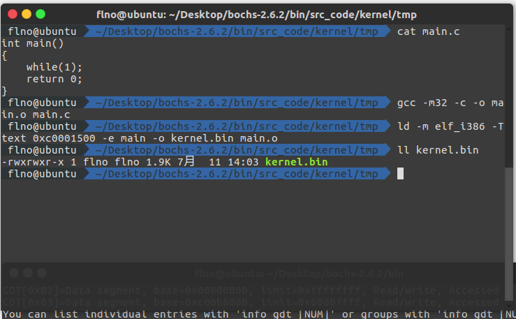

下面通过`dd`命令将其写入磁盘，为了不纠结count的赋值，这里直接赋值为200，seek赋值为9，写在第9扇区

```bash
sudo dd if=./kernel.bin of=YOUR_ENV/bochs-2.6.2/bin/hd60M.img bs=512 count=200 seek=9 conv=notrunc
```

写完之后我们需要修改loader.S中的内容，分两步完成

- 加载内核：内核文件加载到内存缓冲区
- 初始化内核：需要在分页后，将加载进来的elf内核文件安置到相应的虚拟内存地址，然后跳过去执行，从此loader的工作结束

内核的加载地址选取的是`0x7e00~0x9fbff`范围中的0x70000，添加如下片断

```asm
; ------------------ 加载内核 ------------------
mov eax, KERNEL_START_SECTOR  ; kernel.bin所在的扇区号0x9
mov ebx, KERNEL_BIN_BASE_ADDR ; 0x70000
; 从磁盘读出后,写入到ebx指定的地址
mov ecx, 200 ; 读入的扇区数

call rd_disk_m_32 ; eax,ebx,ecx均为参数,从硬盘上读取数据

; 创建页目录及页表并初始化页内存位图
call setup_page
```

下一步是初始化内核的工作，我们需要遍历`kernel.bin`程序中所有的段，因为它们才是程序运行的实质指令和数据的所在地，然后将各段拷贝到自己被编译的虚拟地址中，如下添加的是在`loader.S`中的内容，注释已经很详细了

```asm
 ; -------------------------   加载kernel  ----------------------
   [略...]
   ; 打开cr0的pg位(第31位)
   mov eax, cr0
   or eax, 0x80000000
   mov cr0, eax
   
   ; 在开启分页后，用gdt新的地址重新加载
   lgdt [gdt_ptr] ; 重新加载
   
   jmp SELECTOR_CODE:enter_kernel	  ; 强制刷新流水线,更新gdt,不刷新也可以
enter_kernel:  
   call kernel_init
   mov esp, 0xc009f000     ;进入内核之后栈也要修改
   jmp KERNEL_ENTRY_POINT  ; 用地址0x1500访问测试，结果ok
;----------将kernel.bin中的segment拷贝到编译的地址----------
kernel_init:
   xor eax, eax
   xor ebx, ebx	; 记录程序头表地址
   xor ecx, ecx	; cx记录程序头表中的program header数量
   xor edx, edx	; dx记录program header尺寸,即e_phentsize
	
   mov dx, [KERNEL_BIN_BASE_ADDR + 42] ; 偏移文件42字节处的属性是e_phentsize,表示program header大小
   mov ebx, [KERNEL_BIN_BASE_ADDR + 28] ; 偏移文件开始部分28字节的地方是e_phoff,表示第1个program header在文件中的偏移量

   add ebx, KERNEL_BIN_BASE_ADDR
   mov cx, [KERNEL_BIN_BASE_ADDR + 44]    ; 偏移文件开始部分44字节的地方是e_phnum,表示有几个program header
.each_segment:
   cmp byte [ebx + 0], PT_NULL ; 若p_type等于 PT_NULL,说明此program header未使用。
   je .PTNULL
   
   ;为函数memcpy压入参数,参数是从右往左依然压入.函数原型类似于 memcpy(dst,src,size)
   push dword [ebx + 16] ; program header中偏移16字节的地方是p_filesz,压入函数memcpy的第三个参数:size
   mov eax, [ebx + 4] ; 距程序头偏移量为4字节的位置是p_offset
   add eax, KERNEL_BIN_BASE_ADDR	  ; 加上kernel.bin被加载到的物理地址,eax为该段的物理地址
   push eax
   push dword [ebx + 8] ; 压入函数memcpy的第一个参数:目的地址,偏移程序头8字节的位置是p_vaddr，这就是目的地址
   call mem_cpy ; 调用mem_cpy完成段复制
   add esp,12   ; 清理栈中压入的三个参数, 3 * 4 = 12 字节
.PTNULL:
   add ebx, edx				  ; edx为program header大小,即e_phentsize,在此ebx指向下一个program header 
   loop .each_segment
   ret
   
;----------  逐字节拷贝 mem_cpy(dst,src,size) ------------
;输入:栈中三个参数(dst,src,size)
;输出:无
;---------------------------------------------------------
mem_cpy:
	cld ; 控制重复字符递增方式,也就是edi和esi每复制一次就加一个单位大小,相对的指令为std
	push ebp
	mov esp, ebp
	push ecx ; rep指令用到了ecx，但ecx对于外层段的循环还有用，故先入栈备份
	mov edi, [ebp + 8]  ; dst
	mov esi, [ebp + 12] ; src
	mov ecx, [ebp + 16] ; size
	rep movsb ; 逐字节拷贝,直到ecx为0
	
	; 恢复环境
	pop ecx
	pop ebp
	ret
```

最终的一个内存布局如下，参考之前的1MB实模式地址图来对应就明白了

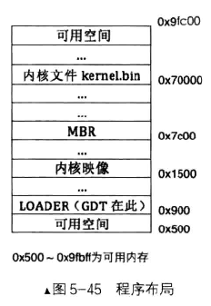

### 特权管理

　　特权级按照权力分为0、1、2、3级，数字越小，级别越高。计算机启动之初就在0级特权运行，MBR则就是0级权限，谈到权限就得提到TSS任务状态段，程序拥有此结构才能运行，相当于一个任务的身份证，结构如下图所示，大小为104字节，其中有很多寄存器信息，而TSS则是由TR寄存器加载的。

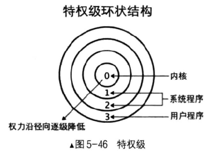


每个特权级只能有一个栈，特权级在变换的时候需要用到不同特权级下的栈，特权转移分为两类，一类是中断门和调用门实现低权限到高权限，另一类是由调用返回指令从高权限到低权限，这是唯一一种让处理器降低权限的方法。

对于低权限到高权限的情况，处理器需要提前记录目标栈的地方，更新SS和ESP，也就是说我们只需要提前在TSS中记录好高特权级的栈地址即可，也就是说TSS不需要记录3级特权的栈，因为它的权限最低。

对于高权限到低权限的情况，一方面因为处理器不需要在TSS中寻找低特权级目标栈的，也就是说TSS也不需要记录3级特权的栈，另一方面因为低权限的栈地址已经存在了，这是由处理器的向高特权级转移指令(int、call等)实现机制决定的。下面就介绍一下权限相关的一些知识点：

**CPL、DPL、RPL**

CPL是当前进程的权限级别(Current Privilege Level)，是当前正在执行的代码所在的段的特权级，存在于cs寄存器的低两位。

RPL是进程对段访问的请求权限(Request Privilege Level)，是对于段选择子而言的，每个段选择子有自己的RPL，它说明的是进程对段访问的请求权限，有点像函数参数。而且RPL对每个段来说不是固定的，两次访问同一段时的RPL可以不同。RPL可能会削弱CPL的作用，例如当前CPL=0的进程要访问一个数据段，它把段选择符中的RPL设为3，这样它对该段仍然只有特权为3的访问权限。

DPL存储在段描述符中，规定访问该段的权限级别(Descriptor Privilege Level)，每个段的DPL固定。当进程访问一个段时，需要进程特权级检查，一般要求DPL >= max {CPL, RPL}

### 门结构

处理器只有通过门结构才能由低特权级转移到高特权级，也可以通过门结构进行平级跳转，所以门相当于一个跳板，当前特权级首先需要大于门的DPL特权级，然后才能使用门来跳到想去的特权级，处理器就是这样设计的，四种门结构分别是：任务门、中断门、陷阱门、调用门。门描述符和段描述符类似，都是8字节大小的数据结构，用来描述门通向的代码，如下所示

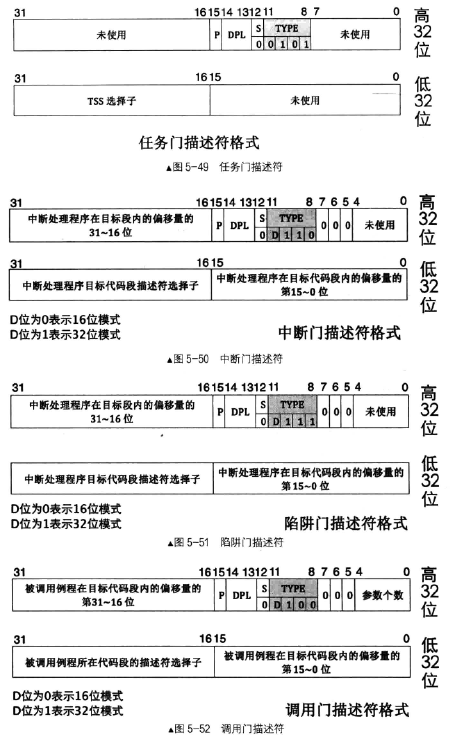

任务门可以放在GDT、LDT、IDT中，调用门位于GDT、LDT中，中断门和陷阱门仅位于IDT中调用方法如下

**调用门**

call 和 jmp 指令后接调用门选择子为参数，以调用函数例程的形式实现从低特权向高特权转移，可用来实现系统调用。 call 指令使用调用门可以实现向高特权代码转移， jmp 指令使用调用门只能实现向平级代码转移。若需要参数传递，则0~4位表示参数个数，然后在权限切换的时候自动在栈中复制参数。关于调用门的过程保护，参考P240

**中断门**

以 int 指令主动发中断的形式实现从低特权向高特权转移， Linux 系统调用便用此中断门实现。

**陷阱门**

以 int3 指令主动发中断的形式实现从低特权向高特权转移，这一般是编译器在调试时用。

**任务门**

任务以任务状态段 TSS 为单位，用来实现任务切换，它可以借助中断或指令发起。当中断发生时，如果对应的中断向量号是任务门，则会发起任务切换。也可以像调用门那样，用 call 或 jmp 指令后接任务门的选择子或任务 TSS 的选择子。

### IO特权级

保护模式下，处理器中的”阶级”不仅体现在数据和代码的访问，还体现在以下只有在0特权级下被执行的特权指令

```
hlt、lgdt、ltr、popf等
```

还有一些IO敏感指令如`in、out、cli、sti`等访问端口的指令也需要在相应的特权级下操作，如果当前特权级小于 IOPL 时就会产生异常，IOTL 在 eflags 寄存器中，没有特殊的指令设置 eflags 寄存器，只有用 popf 结合 iretd 指令，在栈中修改，当然也只有在0特权下才能操作，eflags 寄存器中的 IOTL 位如下所示


附一张图，对以上做一个总结


