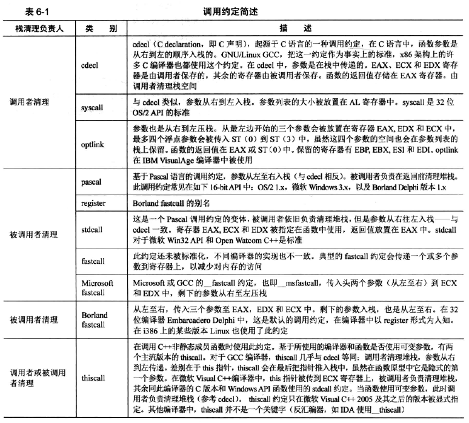
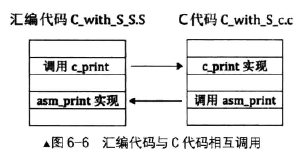
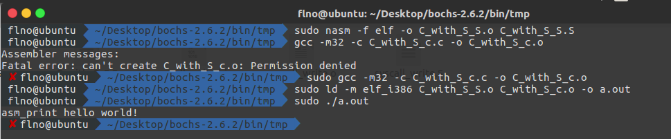
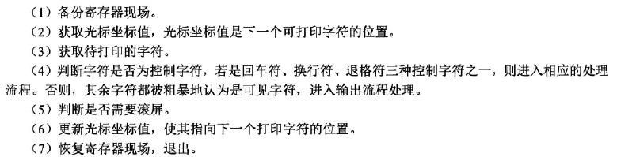
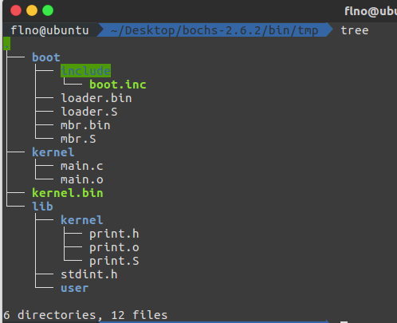
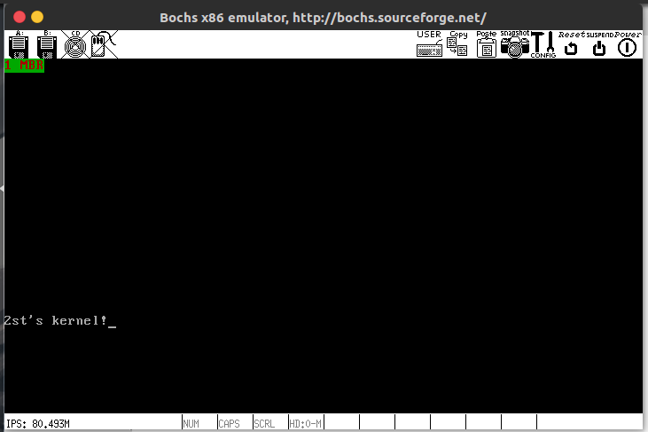

# 完善内核

## 调用约定

调用约定主要体现在以下三方面：

1. 参数的传递方式，参数是存放在寄存器中还是栈中
2. 参数的传递顺序，是从左到右传递还是从右到左传递
3. 是调用者负责清理栈还是被调用者负责



X86下我们主要关注cdecl、stdcall、thiscall这几个，以下给出几个实例。

注：当输入的参数小于等于5个时，linux用寄存器传递参数。当输入的参数大于5个时，把参数按照顺序放入连续的内存中，并把这块内存的首地址放入ebx中

通过寄存器传递参数时

- eax存放子功能号


- ebx存放第一个参数


- ecx存放第二个参数


- edx存放第三个参数


- esi存放第四个参数


- edi存放地五个参数

### cdecl

> 参数从右往左依次入栈，调用者实现栈平衡，返回值存放在 EAX 中。

```asm
20:       int cdecl_sum = cdecl_add(1, 2, 3, 4, 5, 6, 7);
00401138   push        7
0040113A   push        6
0040113C   push        5
0040113E   push        4
00401140   push        3
00401142   push        2
00401144   push        1
00401146   call        @ILT+5(_cdecl_add) (0040100a)
0040114B   add         esp,1Ch  # 栈平衡
0040114E   mov         dword ptr [ebp-4],eax    # 返回值
 
3:    int __cdecl cdecl_add(int a, int b, int c, int d, int e, int f, int g)
4:    {
00401030   push        ebp
00401031   mov         ebp,esp
00401033   sub         esp,44h
00401036   push        ebx
00401037   push        esi
00401038   push        edi
00401039   lea         edi,[ebp-44h]
0040103C   mov         ecx,11h
00401041   mov         eax,0CCCCCCCCh
00401046   rep stos    dword ptr [edi]
5:        int sum = a+b+c+d+e+f+g;
00401048   mov         eax,dword ptr [ebp+8]
0040104B   add         eax,dword ptr [ebp+0Ch]
0040104E   add         eax,dword ptr [ebp+10h]
00401051   add         eax,dword ptr [ebp+14h]
00401054   add         eax,dword ptr [ebp+18h]
00401057   add         eax,dword ptr [ebp+1Ch]
0040105A   add         eax,dword ptr [ebp+20h]
0040105D   mov         dword ptr [ebp-4],eax
6:        return sum;
00401060   mov         eax,dword ptr [ebp-4]    # 存放返回值
7:    }
00401063   pop         edi
00401064   pop         esi
00401065   pop         ebx
00401066   mov         esp,ebp
00401068   pop         ebp
00401069   ret
```

### stdcall

> 参数从右往左依次入栈，被调用者实现栈平衡，返回值存放在 EAX 中。

```asm
21:       int stdcall_sum = stdcall_add(1, 2, 3, 4, 5, 6, 7);
00401151   push        7
00401153   push        6
00401155   push        5
00401157   push        4
00401159   push        3
0040115B   push        2
0040115D   push        1
0040115F   call        @ILT+15(_stdcall_add@28) (00401014)
00401164   mov         dword ptr [ebp-8],eax    # 返回值
 
9:    int __stdcall stdcall_add(int a, int b, int c, int d, int e, int f, int g)
10:   {
00401080   push        ebp
00401081   mov         ebp,esp
00401083   sub         esp,44h
00401086   push        ebx
00401087   push        esi
00401088   push        edi
00401089   lea         edi,[ebp-44h]
0040108C   mov         ecx,11h
00401091   mov         eax,0CCCCCCCCh
00401096   rep stos    dword ptr [edi]
11:       int sum = a+b+c+d+e+f+g;
00401098   mov         eax,dword ptr [ebp+8]
0040109B   add         eax,dword ptr [ebp+0Ch]
0040109E   add         eax,dword ptr [ebp+10h]
004010A1   add         eax,dword ptr [ebp+14h]
004010A4   add         eax,dword ptr [ebp+18h]
004010A7   add         eax,dword ptr [ebp+1Ch]
004010AA   add         eax,dword ptr [ebp+20h]
004010AD   mov         dword ptr [ebp-4],eax
12:       return sum;
004010B0   mov         eax,dword ptr [ebp-4]    # 存放返回值
13:   }
004010B3   pop         edi
004010B4   pop         esi
004010B5   pop         ebx
004010B6   mov         esp,ebp
004010B8   pop         ebp
004010B9   ret         1Ch  # 栈平衡（等价于先 add esp, 1Ch 再 ret）
```

### fastcall

> 参数1、参数2分别保存在 ECX、EDX ，剩下的参数从右往左依次入栈，被调用者实现栈平衡，返回值存放在 EAX 中。

```asm
25:       int fastcall_sum = fastcall_add(1, 2, 3, 4, 5, 6, 7);
00401167   push        7
00401169   push        6
0040116B   push        5
0040116D   push        4
0040116F   push        3
00401171   mov         edx,2
00401176   mov         ecx,1
0040117B   call        @ILT+0(@fastcall_add@28) (00401005)
00401180   mov         dword ptr [ebp-0Ch],eax  # 返回值
 
15:   int __fastcall fastcall_add(int a, int b, int c, int d, int e, int f, int g)
16:   {
004010D0   push        ebp
004010D1   mov         ebp,esp
004010D3   sub         esp,4Ch
004010D6   push        ebx
004010D7   push        esi
004010D8   push        edi
004010D9   push        ecx
004010DA   lea         edi,[ebp-4Ch]
004010DD   mov         ecx,13h
004010E2   mov         eax,0CCCCCCCCh
004010E7   rep stos    dword ptr [edi]
004010E9   pop         ecx
004010EA   mov         dword ptr [ebp-8],edx
004010ED   mov         dword ptr [ebp-4],ecx
17:       int sum = a+b+c+d+e+f+g;
004010F0   mov         eax,dword ptr [ebp-4]
004010F3   add         eax,dword ptr [ebp-8]
004010F6   add         eax,dword ptr [ebp+8]
004010F9   add         eax,dword ptr [ebp+0Ch]
004010FC   add         eax,dword ptr [ebp+10h]
004010FF   add         eax,dword ptr [ebp+14h]
00401102   add         eax,dword ptr [ebp+18h]
00401105   mov         dword ptr [ebp-0Ch],eax
18:       return sum;
00401108   mov         eax,dword ptr [ebp-0Ch]  # 存放返回值
19:   }
0040110B   pop         edi
0040110C   pop         esi
0040110D   pop         ebx
0040110E   mov         esp,ebp
00401110   pop         ebp
00401111   ret         14h  # 栈平衡（等价于先 add esp, 14h 再 ret）
```

## 系统调用

为了更加理解系统调用，在后面会更频繁的结合C和汇编进行操作，下面做一个实验，分别用三种方式调用write函数，模拟下面C调用库函数的过程

```c
#include<unistd.h>
int main(){
    write(1,"hello,world\n",4);
    return 0;
}
```

模拟代码`syscall_write.S`如下

```asm
section .data
str_c_lib: db "C library says: hello world!", 0xa ; 0xa为换行符
str_c_lib_len equ $-str_c_lib

str_syscall: db "syscall says: hello world!", 0xa
str_syscall_len equ $-str_syscall

section .text
global _start
_start:
; ssize_t write(int fd,const void *buf,size_t count);
; 方法一:模拟C语言中系统调用库函数write
	push str_c_lib_len
	push str_c_lib
	push 1
	
	call my_write
	add esp, 12
	
; 方法二:系统调用
;	mov eax, 4               ; 系统调用号;
;	mov ebx, 1               ; fd
;	mov ecx, str_syscall     ; buf
;	mov edx, str_syscall_len ; count
;	int 0x80
	
; 退出程序
	mov eax, 1 ; exit()
	int 0x80

; 下面模拟write系统调用
my_write:
	push ebp
	mov esp, ebp
	mov eax, 4
	mov ebx, [ebp + 8]    ; fd
	mov ecx, [ebp + 0xc]  ; buf
	mov edx, [ebp + 0x10] ; count
	int 0x80
	pop ebp
	ret
```

运行结果如下：


用C结合汇编进行第二个实验:

```c
//C_with_S_c.c
extern void asm_print(char*,int);
void c_print(char* str) {
    int len=0;
    while(str[len++]);   // 循环求出长度len,以'\0'结尾
    asm_print(str, len);
}
```

```asm
;C_with_S_S.S
section .data
str: db "asm_print hello world!", 0xa, 0 ; 0xa为换行符,0为结束符
str_len equ $-str

section .text
extern c_print
global _start
_start:
	push str
	call c_print
	add esp, 4
	
; 退出程序
	mov eax, 1 ; exit()
	int 0x80

; 下面模拟write系统调用
global asm_print
asm_print:
	push ebp
	mov ebp, esp
	mov eax, 4
	mov ebx, 1
	mov ecx, [ebp + 8]   ; str
	mov edx, [ebp + 0xc] ; len
	int 0x80
	pop ebp
	ret
```

调用关系如下：



编译命令：

> nasm -f elf -o C_with_S_S.o C_with_S_S.S
>
> gcc -m32 -c C_with_S_c.c -o C_with_S_c.o
>
> ld -m elf_i386 C_with_S_S.o C_with_S_c.o -o a.out

实验过程：



## 实现打印函数

### 打印单个字符

需要增加一个stdint.h，作用在于申请一些数据结构。

```c
//stdint.h
#ifndef _LIB_STDINT_H_
#define _LIB_STDINT_H_

typedef signed char int8_t;
typedef signed short int int16_t;
typedef signed int int32_t;
typedef signed long long int int64_t;
typedef unsigned char uint8_t;
typedef unsigned short int uint16_t;
typedef unsigned int uint32_t;
typedef unsigned long long int uint64_t;

#endif //!_LIB_STDINT_H_

```

实现print的代码，他需要有以下功能：



```c
//print.h
#ifndef __LIB_KERNEL_PRINT_H // 如果没有__LIB_KERNEL_PRINT_H宏则编译下面的代码
#define __LIB_KERNEL_PRINT_H
#include "stdint.h"
void put_char(uint8_t char_asci); // 这里是8位无符号整型,为了和之前参数存放在cl寄存器长度吻合
#endif

```


```asm
;print.S
TI_GDT equ 0
RPL0 equ 0
SELECTOR_VIDEO equ (0x0003<<3) + TI_GDT + RPL0

[bits 32]
section .text
; ----------------- put_char -----------------
; 把栈中的一个字符写入光标所在处
; --------------------------------------------
global put_char ; 全局变量，外部可调用
put_char:
	pushad ; 备份环境
	; 保证gs中为正确的视频段选择子
	; 为保险起见，每次打印时都为gs赋值
	mov ax, SELECTOR_VIDEO ; 不能直接把立即数送入段寄存器
	mov gs, ax
	
; 获取当前光标位置，25个字符一行，一共80行，从0行开始
; 先获得高8位
	mov dx, 0x03d4  ; 索引寄存器
	mov al, 0x0e    ; 用于提供光标位置的高8位
	out dx, al
	mov dx, 0x03d5  ; 通过读写数据端口0x3d5来获得或设置光标位置
	in  al, dx      ; 得到了光标位置的高8位
	mov ah, al
	
	; 在获取低8位光标
	mov dx, 0x3d4
	mov al, 0x0f
	out dx, al
	mov dx, 0x3d5
	in  al, dx
	; 将16位完整的光标存入bx
	mov bx, ax
	; 下面这行是在栈中获取待打印的字符
	mov ecx, [esp + 36] ; pushad压入4x8=32字节
						; 加上主函数4字节返回地址
	cmp cl, 0xd			; 回车CR是0x0d，换行LF是0x0a
	jz .is_carriage_return
	cmp cl, 0xa
	jz .is_line_feed
	
	cmp cl, 0x8			; BS(backspace)的asc码是8
	jz .is_backspace
	jmp .put_other

.is_backspace:
	;;;;;;;;;;;;;;;;;; 对于backspace的一点说明 ;;;;;;;;;;;;;;;;;;
	; 当为 backspace 时，光标前移一位
	; 末尾添加空格或空字符0
	dec bx
	shl bx, 1				; 光标左移一位等于乘2
							; 表示光标对应显存中的偏移字节
	mov byte [gs:bx], 0x20	; 将待删除的字节补为0或空格皆可
	inc bx
	mov byte [gs:bx], 0x07
	shr bx, 1
	jmp .set_cursor
;;;;;;;;;;;;;;;;;;;;;;;;;;;;;;;;;;;;
.put_other:
	shl bx, 1      			; 光标位置用2字节表示，将光标值乘2         
						    ; 表示对应显存中的偏移字节
	mov [gs:bx], cl         ; ASCII字符本身
	inc bx
	mov byte [gs:bx], 0x07  ; 字符属性
	shr bx, 1				; 恢复老的光标值
	inc bx					; 下一个光标值
	cmp bx, 2000
	jl .set_cursor			; 若光标值小于2000，表示未写到显存的最后，则去设置新的光标值
							; 若超出屏幕字符数大小(2000)则换行处理
.is_line_feed:				; 是换行符LF(\n)
.is_carriage_return:			; 是回车符
; 如果是CR(\r)，只要把光标移到行首就行了
	xor dx, dx 				; dx是被除数的高16位，清0
	mov ax, bx				; ax是被除数的低16位
	mov si, 80              ; 效访Linux中\n表示下一行的行首
	div si					; 这里\n和\r都处理为下一行的行首
	sub bx, dx				; 光标值减去除80的余数便是取整
							; 以上4行处理\r的代码
.is_carriage_return_end:    ; 回车符CR处理结束
	add bx, 80
	cmp bx, 2000
.is_line_feed_end:			; 若是LF(\n)，将光标移+80便可
	jl .set_cursor
; 屏幕行范围是0~24，滚屏的原理是将屏幕的第1~24行搬运到第0~23行，再将第24行用空格填充
.roll_screen:				; 若超出屏幕大小，开始滚屏
	cld
	mov ecx, 960			; 2000-80=1920个字符要搬运，共1920*2=3820字节
							; 一次搬4字节，共3840/4=960次
	mov esi, 0xc00b80a0		; 第一行行首
	mov edi, 0xc00b8000		; 第0行行首
	rep movsd
	
; 将最后一行填充为空白
	mov ebx, 3840			; 最后一行首字符的第一个字节偏移=1920*2
	mov ecx, 80				; 一行是80字符(160字节)，每次清空1字符(2字节)，一行需要移动80次
	
.cls:
	mov word [gs:ebx], 0x0720 	; 0x0720是黑底白字的空格键
	add ebx, 2
	loop .cls
	mov bx, 1920			  	; 将光标值重置为1920，最后一行的首字符

.set_cursor:
; 将光标设为bx值
; 1.先设置高8位
	mov dx, 0x03d4			  	; 索引寄存器
	mov al, 0x0e				; 用于提供光标位置的高8位
	out dx, al
	mov dx, 0x03d5				; 通过读写数据端口0x3d5来获得或设置光标位置
	mov al, bh
	out dx, al
	
; 2.再设置低8位
	mov dx, 0x3d4
	mov al, 0x0f
	out dx, al
	mov dx, 0x03d5
	mov al, bl
	out dx, al
.put_char_done:
	popad
	ret

```

测试主代码main.c

```c
//main.c
#include "print.h"
void main(void){
	put_char('2');
	put_char('s');
	put_char('t');
	put_char('\'');
	put_char('s');
	put_char(' ');
	put_char('k');
	put_char('e');
	put_char('r');
	put_char('n');
	put_char('e');
	put_char('l');
	put_char('!');
	while(1);
}

```

目前工程目录如下：



当前路径下的编译、链接、覆盖命令：

> 编译print.S nasm -f elf -o lib/kernel/print.o lib/kernel/print.S 
>
> 编译main.c gcc -m32 -I lib/kernel/ -c -o kernel/main.o kernel/main.c 
>
> 链接main.o和print.o Id -Ttext 0xc0001500 -e main -o kernel.bin kernel/main.o lib/kernel/print.o 
>
> 写入虚拟硬盘 dd if=kernel.bin of=YOUR_ENV/bochs/hd60M.img bs=512 count=200 seek=9 conv=notrunc

实验结果：



### 打印字符串

对于字符串的操作就是遇到`\0`截断就好了

在print.h中增加一行

```c
void put_str(char* message);
```

在print.S中修改

```asm
; --------------------------------------------
; put_str通过put_char来打印以0字符结尾的字符串
; 输入：栈中参数为打印的字符串
; 输出：无
; --------------------------------------------
global put_str
put_str:
; 此函数用到ebx和ecx，先备份
	push ebx
	push ecx
	xor ecx, ecx
	mov ebx, [esp + 0xc] ; 栈中得到待打印字符串的地址
.goon:
	mov cl, [ebx]
	cmp cl, 0       ; 如果处理到了字符串尾，跳到结束处返回
	jz .str_over
	push ecx		; 为put_char函数传递参数
	call put_char	; 循环调用put_char实现打印字符串
	add esp, 4
	inc ebx			; ebx指向下一个字符
	jmp .goon

.str_over:
	pop ecx
	pop ebx
	ret
```

主测试文件main.c

```c
#include "print.h"
void main(void){
	put_str("2st's kernel\n");
	while(1);
}
```

### 打印整数

就是注意一下处理十六进制的过程

在print.h中增加一行

```c
void put_int(uint32_t num);
```

在print.S中修改

```asm
;print.S
;--------------------   将小端字节序的数字变成对应的ascii后，倒置   -----------------------
;输入：栈中参数为待打印的数字
;输出：在屏幕上打印16进制数字,并不会打印前缀0x,如打印10进制15时，只会直接打印f，不会是0xf
;------------------------------------------------------------------------------------------

global put_int
put_int:
	pushad
	mov ebp, esp
	mov eax, [ebp + 4*9] ; call的返回地址占4字节再加上pushad的8个四字节
	mov edx, eax
	mov edi, 7	; 指定在put_int_buffer中初始的偏移量	
	mov ecx, 8	; 32位数字中，十六进制数字的位数是8个
	mov ebx, put_int_buffer
	
; 将32位数字按照十六进制的形式从低位到高位逐个处理
; 共处理8个十六进制数字
.16based_4bits:	; 每4位二进制是16进制数字的1位
; 遍历每一位十六进制数字
	and edx, 0x0000000F	; 解析十六进制数字的每一位
						; and与操作后，edx只有低4位有效
	cmp edx, 9			; 数字0~9和a~f需要分别处理成对应的字符
	jg .is_A2F
	add edx, '0'		; ASCII码是8位大小。add求和操作后，edx低8位有效
	jmp .store
.is_A2F:
	sub edx, 10			; A~F减去10所得到的差，再加上字符A的
						; ASCII码，便是A~F对应的ASCII码
	add edx, 'A'
; 将每一位数字转换成对应的字符后,按照类似“大端”的顺序存储到缓冲区put_int_buffer
; 高位字符放在低地址,低位字符要放在高地址,这样和大端字节序类似,只不过咱们这里是字符序.
.store:
; 此时dl中应该是数字对应的字符的ASCII码
	mov [ebx + edi], dl
	dec edi
	shr eax, 4
	mov edx, eax
	loop .16based_4bits
	
; 现在put_int_buffer中已全是字符，打印之前
; 把高位连续的字符去掉，比如把字符000123变成123
.ready_to_print:
	inc edi		; 此时edi退减为-1(0xffffffff),加上1使其为0
.skip_prefix_0:
	cmp edi, 8	; 若已经比较第9个字符了
				; 表示待打印的字符串为全0
	je .full0
; 找出连续的0字符，edi作为非0的最高位字符的偏移
.go_on_skip:
	mov cl, [put_int_buffer + edi]
	inc edi
	cmp cl, '0'
	je .skip_prefix_0	; 继续判断下一位字符是否为字符0(不是数字0)
	dec edi				; edi在上面的inc操作中指向了下一个字符
	; 若当前字符不为'0'，要使edi减1恢复指向当前字符
	jmp .put_each_num
	
.full0:
	mov cl, '0'			; 输入的数字为全0时，则只打印0
.put_each_num:
	push ecx			; 此时cl中为可打印的字符
	call put_char
	add esp, 4
	inc edi				; 使edi指向下一个字符
	mov cl, [put_int_buffer + edi] ; 获取下一个字符到cl寄存器
	cmp edi, 8
	jl .put_each_num
	popad
	ret
```

主测试文件main.c

```c
#include "print.h"
void main(void) {
   put_str("I am kernel\n");
   put_int(0);
   put_char('\n');
   put_int(9);
   put_char('\n');
   put_int(0x00021a3f);
   put_char('\n');
   put_int(0x12345678);
   put_char('\n');
   put_int(0x00000000);
   while(1);
}

```

