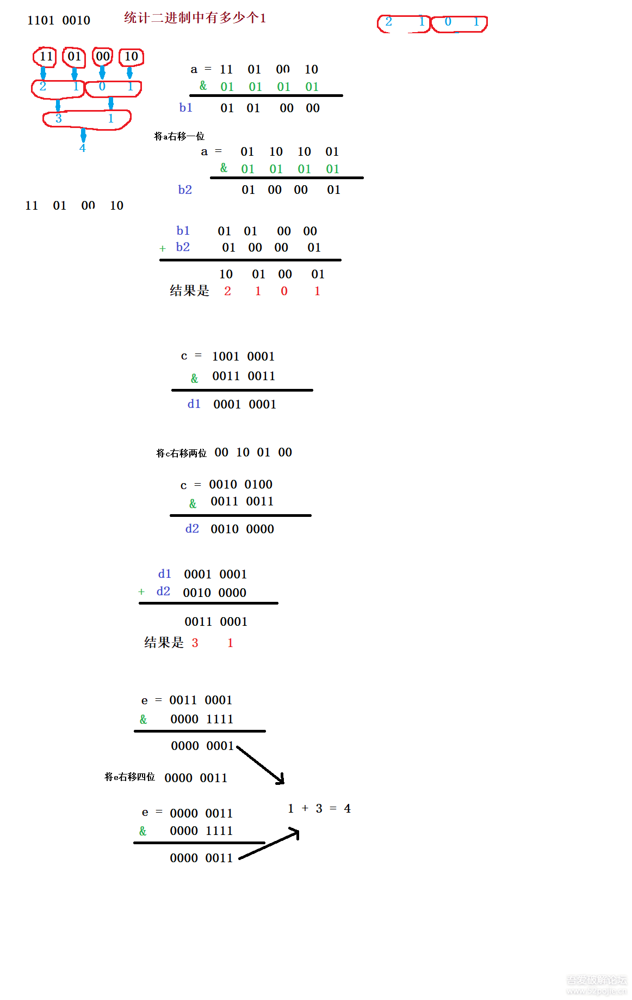

# Data Lab

任务总评：极好地帮助你认识计算机中的数据存储

## bitAnd

```c
/*
 * bitAnd - x&y using only ~ and |
 *   Example: bitAnd(6, 5) = 4
 *   Legal ops: ~ |
 *   Max ops: 8
 *   Rating: 1
 */
int bitAnd(int x, int y) {
  return ~((~x)|(~y));
}
```

德摩根定律

## getByte

```c
/*
 * getByte - Extract byte n from word x
 *   Bytes numbered from 0 (LSB) to 3 (MSB)
 *   Examples: getByte(0x12345678,1) = 0x56
 *   Legal ops: ! ~ & ^ | + << >>
 *   Max ops: 6
 *   Rating: 2
 */
int getByte(int x, int n) {
  int mask=0xff;
  return (x>>(n<<3))&mask;
}
```

直接右移，取最后8位，也就是&0xff

## logicalShift

```c
/*
 * logicalShift - shift x to the right by n, using a logical shift
 *   Can assume that 0 <= n <= 31
 *   Examples: logicalShift(0x87654321,4) = 0x08765432
 *   Legal ops: ! ~ & ^ | + << >>
 *   Max ops: 20
 *   Rating: 3
 */
int logicalShift(int x, int n) {
  int mask=((0x1<<(32+~n))+~0)|(0x1<<(32+~n));
  return (x>>n)&mask;
/*  int c=((0x1<<31>>31)^0x1)<<31;
  return ((x>>n)^(c>>n)); it's wrong for 0x0>>0x1==0x0
*/
/*Bug: return ~((~x)>>n); it's wrong for ~x is postive while x is negative
*/
}
```

算术右移是>>，高位会用最高有效位填充，逻辑右移用0填充。所以任务目标是锁定最高位右移n次之后的位置，即31-n，因为不能用减法所以用`(31+(~n+1))`代替。把输入右移n位，然后`&`一个低y位为1，其余为0的数。

这个数为(1<<(y+1))-1，代码中的写法可以防止溢出。

## bitcount

```c
/*
 * bitCount - returns count of number of 1's in word
 *   Examples: bitCount(5) = 2, bitCount(7) = 3
 *   Legal ops: ! ~ & ^ | + << >>
 *   Max ops: 40
 *   Rating: 4
 */
int bitCount(int x) {
  int _mask1=(0x55)|((0x55)<<8);
  int _mask2=(0x33)|((0x33)<<8);
  int _mask3=(0x0f)|((0x0f)<<8);
  int mask1=(_mask1)|(_mask1<<16);
  int mask2=(_mask2)|(_mask2<<16);
  int mask3=(_mask3)|(_mask3<<16);
  int mask4=(0xff)|(0xff<<16);
  int mask5=(0xff)|(0xff<<8);
  int ans=(x&mask1)+((x>>1)&mask1);
  ans=(ans&mask2)+((ans>>2)&mask2);
  ans=(ans&mask3)+((ans>>4)&mask3);
  ans=(ans&mask4)+((ans>>8)&mask4);
  ans=(ans&mask5)+((ans>>16)&mask5);
  return ans;
}
//方法2
int count_ones2(int a)
{
    int m_1 = 0x55555555; // 01 01 01 ..
    int m_2 = 0x33333333; // 0011 0011 ..
    int m_4 = 0x0f0f0f0f; // 0000 1111
    int m_8 = 0x00ff00ff; // 00000000 11111111
    int m_16 = 0x0000ffff;// 0000... 1111...
     
    int b = (a & m_1) + ((a >> 1)&m_1);
    int c = (b & m_2) + ((b >> 2)&m_2);
    int d = (c & m_4) + ((c >> 4)&m_4);
    int e = (d & m_8) + ((d >> 8)&m_8);
    int f = (e & m_16) + ((e >> 16)&m_16);
     
    return f;
}
```

任务是计算1的个数，用到了分治的思想，这道题很棒，贴一张图就可以明白了。



## bang

```c
/*
 * bang - Compute !x without using !
 *   Examples: bang(3) = 0, bang(0) = 1
 *   Legal ops: ~ & ^ | + << >>
 *   Max ops: 12
 *   Rating: 4
 */
int bang(int x) {
  x=(x>>16)|x;
  x=(x>>8)|x;
  x=(x>>4)|x;
  x=(x>>2)|x;
  x=(x>>1)|x;
  return ~x&0x1;
}
//方法二
int bang(int x) {
  return ((~(x|(~x+1)))>>31)&1;
}
```

不用`!`完成逻辑取反

方法一：

最后的return一行解决了0的问题，前面的一系列操作可以看成把一个int每个位有1的可能性覆盖到最后一位。解释一下：因为非0数字的32bit中定有一个1，通过一系列操作必然会落到最后一位。

方法二：

对0返回1，其他数字返回0，这就要观察0和其他数字的性质有啥区别了。

发现只有0和-0的二进制中，最高位都不是1，其他数字x，x或者-x中总有一个的最高位为1，这个性质就可以很好的解决这个题，把x和-x或起来之后就解决了。（[参考链接](https://zhuanlan.zhihu.com/p/28335741)）

## tmin

```c
/*
 * tmin - return minimum two's complement integer
 *   Legal ops: ! ~ & ^ | + << >>
 *   Max ops: 4
 *   Rating: 1
 */
int tmin(void) {
  return 0x1<<31;/*tmin==~tmax*/
}
```

返回最小的补码

## fitBits

```c
/*
 * fitsBits - return 1 if x can be represented as an
 *  n-bit, two's complement integer.
 *   1 <= n <= 32
 *   Examples: fitsBits(5,3) = 0, fitsBits(-4,3) = 1
 *   Legal ops: ! ~ & ^ | + << >>
 *   Max ops: 15
 *   Rating: 2
 */
int fitsBits(int x, int n) {
  int c=33+~n;
  int t=(x<<c)>>c;
  return !(x^t);
}
```

求x是否在n位补码的范围内。

## divpwr2

```c
/*
 * divpwr2 - Compute x/(2^n), for 0 <= n <= 30
 *  Round toward zero
 *   Examples: divpwr2(15,1) = 7, divpwr2(-33,4) = -2
 *   Legal ops: ! ~ & ^ | + << >>
 *   Max ops: 15
 *   Rating: 2
 */
int divpwr2(int x, int n) {
  int bias=(x>>31)&((0x1<<n)+~0);
  return (x+bias)>>n;
}
```

补码除以2的n次

## negate

```c
/*
 * negate - return -x
 *   Example: negate(1) = -1.
 *   Legal ops: ! ~ & ^ | + << >>
 *   Max ops: 5
 *   Rating: 2
 */
int negate(int x) {
  return ~x+1;
}
```

-x

## isPositive

```c
/*
 * isPositive - return 1 if x > 0, return 0 otherwise
 *   Example: isPositive(-1) = 0.
 *   Legal ops: ! ~ & ^ | + << >>
 *   Max ops: 8
 *   Rating: 3
 */
int isPositive(int x) {
  return !(!(x))&!((x>>31)&(0x1));
}
```

判断是否是正数。

`&`右侧非常好理解，左侧的用意是判0，两次`!`的作用相当于把0->False，非0->True，这个概念需要记住。

## isLessOrEqual

```c
/*
 * isLessOrEqual - if x <= y  then return 1, else return 0
 *   Example: isLessOrEqual(4,5) = 1.
 *   Legal ops: ! ~ & ^ | + << >>
 *   Max ops: 24
 *   Rating: 3
 */
int isLessOrEqual(int x, int y) {
  int val=!!((x+~y)>>31);
  x=x>>31;
  y=y>>31;
  return (!!x|!y)&((!!x&!y)|(val));
}
```

做减法，注意溢出

## ilog2

```c
/*
 * ilog2 - return floor(log base 2 of x), where x > 0
 *   Example: ilog2(16) = 4
 *   Legal ops: ! ~ & ^ | + << >>
 *   Max ops: 90
 *   Rating: 4
 */
int ilog2(int x) {
  int ans=0;
  ans=(!!(x>>(16)))<<4;
  ans=ans+((!!(x>>(8+ans)))<<3);
  ans=ans+((!!(x>>(4+ans)))<<2);
  ans=ans+((!!(x>>(2+ans)))<<1);
  ans=ans+((!!(x>>(1+ans)))<<0);
  return ans;
}
```

log2(x)就是x二进制里最高位的1在哪里。

想法也是类似分治，首先log2(x)=16×a+8×b+4×c+2×d+1×e，abcde都是0或者1，有这样的公式。

上面的代码就是求这个公式的实现。右移16位，判是否为0，就是a的值

知道了a之后，右移（8+16×a）位，判断是否为0，得到b的值。

以此类推。

## float_neg

```c
/*
 * float_neg - Return bit-level equivalent of expression -f for
 *   floating point argument f.
 *   Both the argument and result are passed as unsigned int's, but
 *   they are to be interpreted as the bit-level representations of
 *   single-precision floating point values.
 *   When argument is NaN, return argument.
 *   Legal ops: Any integer/unsigned operations incl. ||, &&. also if, while
 *   Max ops: 10
 *   Rating: 2
 */
unsigned float_neg(unsigned uf) {
  int c=0x00ffffff;
  if(((uf<<1)^(0xffffffff))<c){
    return uf;
  }else{
    return uf^(0x80000000);
  }
}
```

顾名思义

## float_i2f

```c
/*
 * float_i2f - Return bit-level equivalent of expression (float) x
 *   Result is returned as unsigned int, but
 *   it is to be interpreted as the bit-level representation of a
 *   single-precision floating point values.
 *   Legal ops: Any integer/unsigned operations incl. ||, &&. also if, while
 *   Max ops: 30
 *   Rating: 4
 */
unsigned float_i2f(int x) {
  int n=0xffffffff;
  int e=0; /* exp */
  int tmp=0;
  int tmp2=0;
  int cp=0;
  int cp2=0;
  int sign=x&0x80000000; /* 0x80000000 or 0x0 */

  if(x==0x80000000){
      return 0xcf000000;
    }
  if(x==0){
    return 0;
  }
  if(sign){
      x=-x;
  }

  x=x&0x7fffffff; /* remove sign */
  tmp=x;
  while(tmp){
    tmp=tmp>>1;
    n++;
  }

  x=x-(0x1<<n); /* remove highest bit */
  if(n<24){
    x=x<<(23-n);
  }else{
    tmp2=x>>(n-23);
    cp2=0x1<<(n-24);
    cp=x&((cp2<<1)-1);
    if(cp<cp2){
      x=tmp2;
    }else{
      if(tmp2==0x7fffff){
        x=0;
        n++;
      }else{
        if(cp==cp2){
          x=((tmp2)&0x1)+tmp2;
        }else{
          x=tmp2+1;
         }
       }
     }
   }
  e=(127+n)<<23;
  return sign|e|x;
}
```

计算float(x)，考察基本的对于 IEEE 浮点数格式的转换了，思路也比较清晰，就是根据不同的部分来求出对应的值

## float_twice

```c
/*
 * float_twice - Return bit-level equivalent of expression 2*f for
 *   floating point argument f.
 *   Both the argument and result are passed as unsigned int's, but
 *   they are to be interpreted as the bit-level representation of
 *   single-precision floating point values.
 *   When argument is NaN, return argument
 *   Legal ops: Any integer/unsigned operations incl. ||, &&. also if, while
 *   Max ops: 30
 *   Rating: 4
 */
unsigned float_twice(unsigned uf) {
  int tmp=uf;
  int sign=((uf>>31)<<31); /* 0x80000000 or 0x0 */
  int exp=uf&0x7f800000;
  int f=uf&0x7fffff;
  tmp=tmp&0x7fffffff; /* remove sign */
  if((tmp>>23)==0x0){
    tmp=tmp<<1|sign;
    return tmp;
  } else if((tmp>>23)==0xff){
    return uf;
  }  else{
    if((exp>>23)+1==0xff){
      return sign|0x7f800000;
    }else{
      return sign|(((exp>>23)+1)<<23)|f;
    }
  }
  return tmp;
}

```

和上题一样，这个就是考察基本的对于 IEEE 浮点数格式的转换了，思路也比较清晰，就是根据不同的部分来求出对应的值