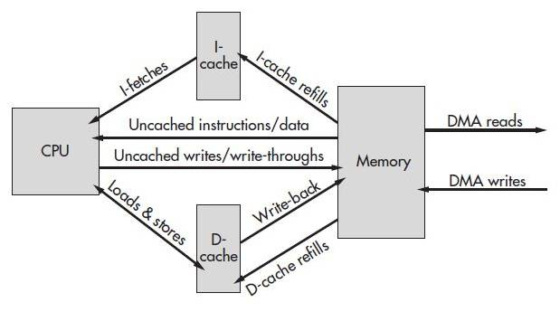
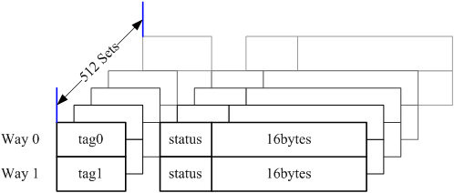
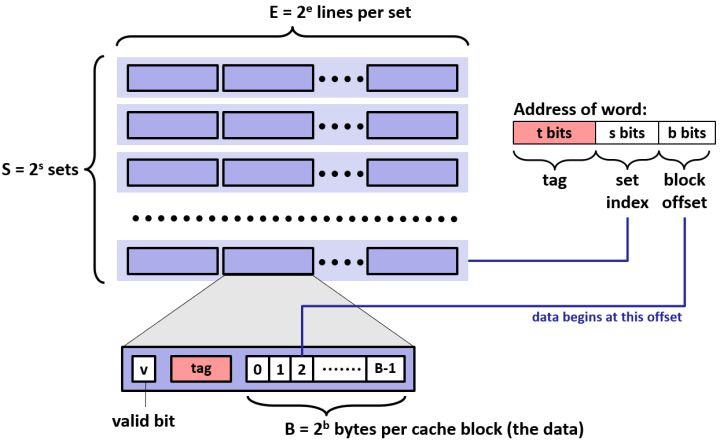
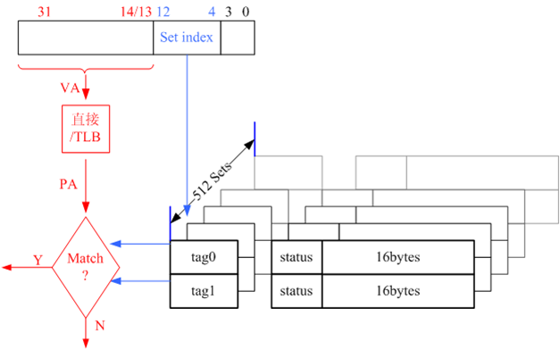
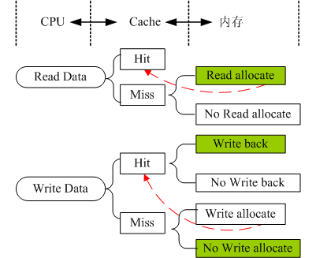

# 概述

Cache是用来对内存数据的缓存。CPU要访问的数据在Cache中有缓存，称为“命中” (Hit)，反之则称为“缺失” (Miss)。CPU访问它的速度介于寄存器与内存之间（数量级的差别）。实现Cache的花费介于寄存器与内存之间。

现在 CPU 的 Cache 又被细分了几层，常见的有 L1 Cache, L2 Cache, L3 Cache，其读写延迟依次增加，实现的成本依次降低。现代系统采用从 Register ―> L1 Cache ―> L2 Cache ―> L3 Cache ―> Memory ―> Mass storage的层次结构，是为解决性能与价格矛盾所采用的折中设计。下图描述的就是CPU、Cache、内存、以及DMA之间的关系。程序的指令部分和数据部分一般分别存放在两片不同的cache中，对应指令缓存（I-Cache）和数据缓存（D-Cache）。

引入 Cache 的理论基础是程序局部性原理，包括时间局部性和空间局部性。即最近被CPU访问的数据，短期内CPU 还要访问（时间）；被 CPU 访问的数据附近的数据，CPU 短期内还要访问（空间）。因此如果将刚刚访问过的数据缓存在Cache中，那下次访问时，可以直接从Cache中取，其速度可以得到数量级的提高。

# Cache结构

## 个人搜集理解：

根据Cache相联方式的不同，Cache有3类：直接相联，全相联，组相联。在这里我们只介绍组相连的Cache结构。因为组相联 Cache 则是直接相联与全相联的一个折衷，兼顾性能与价格，也是最常见，最普遍的Cache结构。首先给出组相连Cache的结构图。以harrier平台的CPU芯片BCM5836的Cache为例。

对照上面的Cache结构图，下面说明如何来说明Cache的指标。

1. Cache的大小，也就是能够存放多少字节。一般有16KBytes，32KBytes等。例如上面的这个Cache的大小就是16KBytes。后面会说明这16KB是如何组成的。
2. Cache有多少路？英文中，“路”表示为way。例如上面的Cache就是两路相连，分别为Way0、Way1。
3. Cache有多少组？英文中，“组”表示为set。例如上面的Cache一共拥有512组。
4. Cache的行大小？英文中，“行”表示为line。在上图中，行没有标示出来，行其实就是某一路的某一组，或者某一组的某一路。上面的虽然有点儿绕，其实就是看到的tag0、status、16bytes就是一行。行的大小就是16bytes。Cache的大小就是所有的这些行的大小。

现在就知道Cache的大小是如何算得：16Bytes（行大小）*2（路）*512（组）=16KBytes。

## **csapp中提到的结构：**

Cache共有S组，每组E行，每行包括一个有效位(valid bit)，一个标签和B比特数据。当E=1时，称为直接映射，当E > 1时，称为E路组相连。

Cache由硬件管理，硬件在得到内存地址后会将地址划分为三个部分。首先根据组下标选择一个组，然后将地址中的标签与被选中组的每个行中的标签进行比较，如果标签相等，且有效位为1，则Cache命中，再根据块偏移从行中选出相应的数据。

详见`结构.pdf`

# Cache工作方式

## 个人搜集理解：

下面介绍组相连Cache的工作方式。

**首先看的是CPU是如何获取Cache中的数据的。** 如下图所示。

假设这里是16KBytes的指令Cache（I-Cache），那么左上角32位的虚拟地址就是PC指针中的值（如果PC指针存在的话）。32位的地址在图中使用了3中颜色标记（黑色：bit0~bit3；蓝色：bit4~bit12；红色：bit13~bit31）。下面就是CPU从Cache中获取指令的过程：

1. 匹配组。蓝色的9bit选择某一个组（一共512个组，9bit表示完）；
2. 匹配路。匹配是上一步选定的组中的哪一路。在这里，有两种选择路的方式：index类型和hit类型。
3. 匹配tag头。将红色部分的虚拟地址（VA）转化成物理地址（PA），转化的物理地址和tag头中的匹配，那么就认为该地址处的值在Cache中存在，也就命中（hit）Cache。如果不匹配，那么就认为该指令在Cache中不存在，未命中（miss），此时就需要到内存中取指令。
4. 匹配指令位置。通过上面三步，已经找到Cache中的某一行了。但是一行中有16个字节，应该取那一个（或者连续几个）呢？黑色的4bit来确定。

CPU和数据Cache（D-Cache）的交互基本上也是这样的。存在差别的地方时第三步，匹配tag头。对于指令Cache，不允许修改的（绝大部分情况），所以匹配到tag头，就认为Cache命中了，可以把Cache中的指令读取到CPU执行了。但是数据Cache可能被修改了（corrupt），内存中的和Cache中的不相同了，这个时候，还需要查看数据Cache是否有效（valid）。

还需要强调的一点是，上面的过程完全由硬件完成，程序员不能够操控其中的任何环节。

**然后要看的是Cache和内存如何交互数据。** 如下图所示。

在CPU如何获取Cache中的数据的问题中，还遗留有三个问题：第一，CPU读取Cache中的数据，没有命中（miss）应该怎么办？第二，对于数据Cache，CPU修改了某个数据的值，并把它写回到Cache中，造成Cache中的数据和内存中的数据不一致怎么办？第三，对于数据Cache，CPU修改了某个数据的值，并把它写回到Cache中，结果没有命中（miss）应该怎么办？这三个问题，就是这一段Cache和内存如何交互需要解决的问题。

首先看图中Read Data->Miss的过程，CPU读取Cache中的数据，没有命中应该怎么办？

> 读数据时Cache miss，实际实现中有2种策略：Read-allocate和No read-allocate(Read through)。现代的实现一般皆为Read-allocate，即：先从Cache中分配一行，后从RAM中读数据填充之，尔后将数据传给CPU。No read-allocate 则是直接从RAM取数据到CPU（不经Cache）。若非特别指出，读策略皆默认为Read-allocate。

然后看图中Write Data->Hit的过程，CPU修改数据Cache，命中，可能造成数据Cache和内存中的值不一致应该怎么办？

> 在写命中(store hit)时，Cache的实现亦有两种策略：Write-back和Write-through。Write-through的Cache，在 write hit时，会将数据更新到Cache和RAM。Write-back的Cache，在write hit时，则仅将数据更新到Cache且将被更新的行标为'dirty'，当该行被替换时控制器才将该行数据写回到内存。对于Write-back的Cache，在连续多次写数据时可以节约总线带宽，性能要好于Write- through，但由于其缓存的数据往往是最新的，与内存中的数据多数时候是不一致的，因此需要软件来维护其一致性。

最后看图中Write Data->Miss的过程，CPU修改数据Cache，未命中，这时应该如何处理呢？

> 写数据时Cache miss，实现的策略和读数据时Cache miss类似，有两种：Write-allocate和No write-allocate。前者的处理方式是先分配一行，后从RAM中读数据填充之（相当于一个 read miss refill 过程），最后才将数据写入 Cache（到此，亦会根据写命中store hit进行后面的操作）。No read-allocate (Write-around)的处理方式则是绕过这一级Cache（不分配Cache line），直接将数据送到下一级Cache/Memory。有些MIPS 的实现两种写策略皆支持。

其实，上面的Cahce和内存交互是一个策略问题。一般都使用Read-allocate，Write-back，No write-allocate的策略，对于具体芯片实现，需要参考其data sheet。

## csapp提供的思路：

向内存中写数据时，可能会发生以下几种情况：

- 写命中

- - write-through：直接写内存
  - write-back：先写Cache，当该行被替换时再写内存。此时需要一个额外的dirty位。

- 写不命中

- - write-allocate：将内存数据读入Cache中，再写Cache
  - no-write-allocate：直接写内存

Cache 失效的三种原因：

- Cold miss：刚刚使用Cache时Cache为空，此时必然发生Cache miss。
- Capacity miss：程序最经常使用的那些数据(工作集,working set)超过了Cache的大小
- Conflict miss：Cache容量足够大，但是不同的数据映射到了同一组，从而造成Cache line反复被替换的现象。

Cache是由硬件管理的，我们普通程序员不必考虑如何去管理Cache，我们需要考虑的是如何利用系统提供给我们的Cache来加速程序的执行。

通常有以下几种方法：

- 重新排列循环次序，提高空间局部性
- 使用分块技术，提高时间局部性

# LRU原理

LRU（Least recently used，最近最少使用）算法根据数据的历史访问记录来进行淘汰数据，其核心思想是“如果数据最近被访问过，那么将来被访问的几率也更高”。

- 最常见的实现是使用一个链表保存缓存数据，详细算法实现如下

1. 新数据插入到链表头部；
2. 每当缓存命中（即缓存数据被访问），则将数据移到链表头部；
3. 当链表满的时候，将链表尾部的数据丢弃。
    【命中率】
    当存在热点数据时，LRU的效率很好，但偶发性的、周期性的批量操作会导致LRU命中率急剧下降，缓存污染情况比较严重。
    【复杂度】
    实现简单。
    【代价】
    命中时需要遍历链表，找到命中的数据块索引，然后需要将数据移到头部。